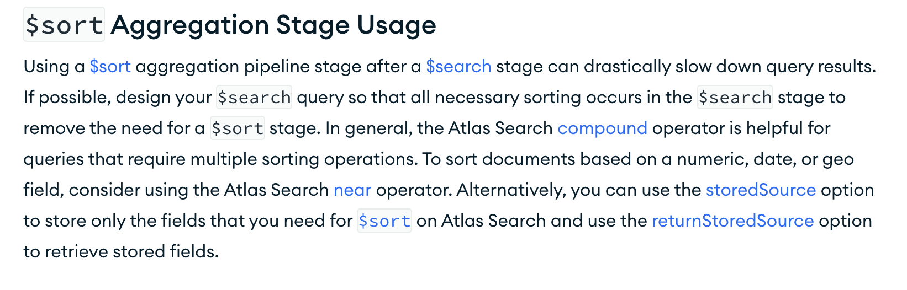
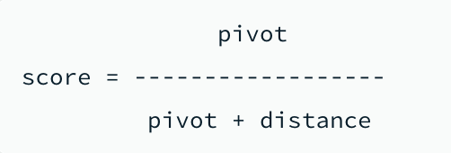

# mongoDB 정렬 이슈 및 score 기준 정렬 방법


## 이슈 사항
- mongoDB atlas search를 사용하여 검색 엔진을 구축한 상황
- 요구사항에 다양한 검색 정렬 방식으로 정렬 필요 (정확도순, 좋아요순, 최신순, 인기순 등)
- 정확도 순은 atlas search 에서 기본적으로 검색후 검색어와의 유사도 기반으로 정렬해주기 때문에 별도의 정렬 처리를 할 필요가 없었음.
- 그러나, 좋아요순, 최신순, 인기순 등의 정렬은 `ORDER BY` 키워드 와 같은 별도의 정렬 처리 필요.

## 첫번째 해결 방법
- mongoDB aggregation pipeline 에서 `$sort` stage 를 사용하여 정렬 처리
```
db.aggregate([
  {
    $search: {
      text: {
        query: 'searchTerm',
        path: ['title', 'content']
      }
    }
  },
  {
    $sort: {
      'likeCount': -1 // 좋아요순 정렬 
    }
  }
])

```
- 해결했다고 생각했지만 쿼리 지연 및 성능 이슈가 발생

## 첫번째 해결 방법의 문제점


- [공식문서](https://www.mongodb.com/docs/atlas/atlas-search/performance/query-performance/#-sort-aggregation-stage-usage)를 확인해보니 `$search`stage 다음 `$sort`stage를 사용하면 성능 이슈가 발생할 수 있다고 명시되어 있음.
- atlas search 는 두개의 프로세스가 존재
    - mongot: Apache Lucene 기반의 자바 웹 프로세스, `$search`stage를 처리
    - mongod: MongoDB 시스템의 기본 데몬 프로세스 `$sort`stage를 처리
- `$search` 와 `$sort` 두 stage를 사용하게 되면
    1. `mongot`에서 검색어에 해당하는 항복의 id, 메타데이터를 반환
    2. `mongod`에서 받은 id를 기반으로 DB 컬렉션 데이터 조회
    3. `mongod`에서 조회된 데이터를 `$sort` stage 를 통해 정렬
- 위의 2.3 과정에서 대량의 데이터를 조회 및 정렬하는 과정에서 지연 발생

<br><br>
## 두번째 해결 방법 (storedSource +  returnStoredSource)
### storedSource 
- :옵션에 정의한 필드는 mongot에 프로세스에 저장되어짐.
- 인덱스 정의에서 생성 가능 
```
{
 'stouredSource': ['likeCount']
}
```
### returnStoredSource 
- atlas search가 DB에서 전체 문서 조회를 수행해야 하는지 아니면 저장된 필드를 atlas search에서 직접 반환해야 하는지를 지정
  - `true` : atlas search에서 직접 저장된 소스 필드만 반환.
  - `false` : DB에서 암시적 전체 문서 조회(기본값)

```
db.aggregate([
  {
    $search: {
      text: {
        query: 'searchTerm',
        path: ['title', 'content']
      },
      returnStoredSource: true
    }
  },
  {
    $sort: {
      'likeCount': -1  
    }
  }
])
```
- monod가 추가적으로 데이터를 조회할 필요없이 `likeCount` 필드를 기반으로 정렬을 수행하기 때문에 성능 이슈가 해결됨.
- 컬렉션 직접 조회 없이 필터,정렬 등에 필요한 모든 필드가 역인덱스에 저장되어있는 방식이기 때문에 커버링 인덱스와 유사하게 동작.
- 정렬필드 외에 추가적으로 필요한 필드가 있다면, `$lookup` stage를 사용하여 추가적인 필드를 조회할 수 있음.

```
db.aggregate([
  {
    $search: {
      text: {
        query: 'searchTerm',
        path: ['title', 'content']
      },
      returnStoredSource: true
    }
  },
  {
    $sort: {
      'likeCount': -1  
    }
  },
  {
    $lookup: {
      from: "questions", localField: "_id", foreignField: "_id", as: "document"
    }
  }
])
```

## 두번째 문제 해결 방법의 문제점
- `$lookup`과 같은 추가 stage가 필요하며 기존보다 더 복잡한 쿼리형태를 가짐.
- 검색 인덱스에 id + 정렬 필드까지 저장해야 하기 때문에 인덱스 사이즈가 커질 수 있음.
- 최대로 사용할수 있는 정렬 메모리 용량을 벗어나는 경우가 발생
- 특정 조건만 가중치를 두고 정렬을 수행해야 하는 경우에는 사용하기 어려움.

## 세번째 해결 방법 (near operator + score function)
### near operator
- atlas search operator 중 하나
- 지정된 필드의 값이 특정 기준값(origin)에 가까울수록 score가 높아지는 방식으로 정렬
- 정렬 필드가 number, date, geometry 타입인 경우 사용 가능

### Syntax
```
{
   $search: {
      "index": <index name>, // optional, defaults to "default"
      "near": {
         "path": "<field-to-search>",
         "origin": <date-or-number>,
         "pivot": <pivot-distance>,
      }
   }
}
```
- path 
  - 역인덱싱된 필드
  - string, string[] 타입을 가짐.
- origin
  - 기준값
  - number, date 타입
- pivot
  - 숫자형 타입

### 계산식
- score = pivot / (pivot + |origin - path|)



- distance 가 0에 가까울수록 score 가 1에 가까워짐
- distance 가 커질수록 score 가 0에 가까워짐

### 예시
```
db.aggregate([
  {
    $search: {
      compound: {
        filter: [
          { text: { 
              query: "searchTerm", 
              path: ['title', 'content']
             }
           }
        ],
        should: {
          near: {
            path: "likeCount",
            origin: 100000,
            pivot: 1
          } // 좋아요수 값이 100000에 가까울수록 score가 높아짐
        }
      }
    }
  }
])
```
- 이때 `origin` 값은 `path` 에 지정된 필드 값보다 충분히 커야 값의 역전현상이 발생하지 않음.

### score function
- `score function` 에서 `path` 에 지정된 필드 값을 기반으로 score 를 계산하여 반환
- 표현식
함수 옵션과 함께 다음 표현식을 사용하여 문서의 최종 점수를 변경
  - Arithmetic expressions: 일련의 숫자를 더하거나 곱하는 표현식
  - Constant expressions: 고정된 상수 값으로 점수를 설정하는 표현식 
  - Gaussian decay expressions: 지정된 비율로 곱하여 점수를 감쇠시키거나 감소시키는 표현식 
  - Path expressions: 인덱싱된 숫자 필드 값을 함수 점수에 통합하는 표현식 
  - Score expressions: Atlas Search에서 할당된 관련성 점수를 반환 
  - Unary expressions: 지정된 숫자의 log10(x) 또는 log10(x+1)을 계산되어지는 표현식
  - [공식문서](https://www.mongodb.com/docs/atlas/atlas-search/score/modify-score/#function) 참고
- 함수 표현식의 계산을 통해 정렬 후 2차 정렬을 `$near operator` 를 통해 수행할 수 있음.

### 예시
```
db.aggregate([
  {
    $search: {
      compound: {
        filter: [
          { text: { 
              query: "searchTerm", 
              path: ['title', 'content']
             }
           }
        ],
        should: {
          near: {
            path: "_id",
            origin: 100000,
            pivot: 100000,
            score: {
              function: {
                add: [ // 아래 두 점수를 더해 최종 점수로 계산
                  { path: "likeCount" },  // path 로 계산한 score
                  { score: "relevance" }  // $near 로 계산한 score
                ]
              }
            }
          } 
        }
      }
    }
  }
])
```

