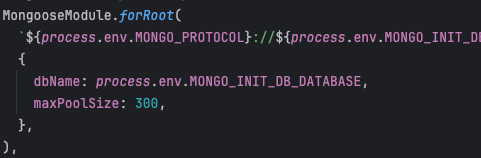

### MongoDB Client Connection Pool Size 조정

보통의 데이터베이스는 서버(애플리케이션)과의 connection pool 을 맺어 DB IO 작업을 수행합니다.  
이때 서버(애플리케이션)당 하나의 DB 인스턴스를 생성하고 mongodb 는 MongoClient 가 이에 해당합니다.  
MongoClient 의 커넥션 최대 pool 사이즈를 애플리케이션내에서 조정할수 있습니다. 
조정을 따로 하지않으면 기본값인 100 의 사이즈만을 가지게 됩니다.  

그래서 만일 mongoDB 자체의 connection pool 사이즈가 몇 천개의 수를 가지고 있다고 하더라도
각각의 MongoClient 의 커넥션 풀 사이즈가 100으로 제한되기에 서버 하나다 커넥션을 최대 100밖에 연결할수 없습니다.

그리하여 MongoClient의 커넥션 풀 사이즈를 적정 수준(여기서 말하는 적정 수준이란 db 에 연결되어있는 MongoClient 수(=서버 수)도 고려)으로
설정해주어야 합니다.

