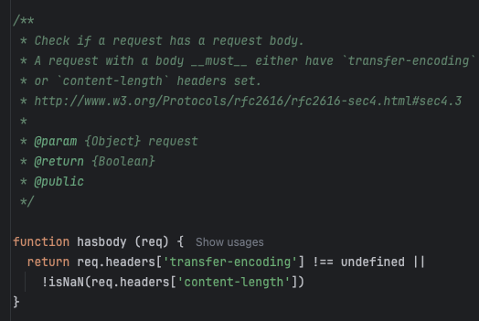

## dart dio http 라이브러리 사용시 발생하는 문제점

모바일 앱 클라이언트에서 `get` 메소드 요청인 상황에서 `Transfer-Encoding: chunked` header 값을 보냄
http1.1 이 아닌 http2 에서 아래의 연결별 의미 쳬계를 갖는 헤더 설정값들은 잘못된 형식으로 처리되어짐. (https://httpwg.org/specs/rfc9113.html#rfc.section.8.2.2)
- Proxy-Connection
- Keep-Alive
- Transfer-Encoding

`Transfer-Encoding: chunked` 가진 헤더인 경우 body 페이로드가 있을것이라고 `body-parser` 는 체크 
 

그로 인해 body-parser 에서 hang 이 걸리는 이슈, **결국 socket timeout 을 다 소진하여 request.aborted 오류를 냄.**       
해당 이슈 파악후 클라이언트에서 수정
