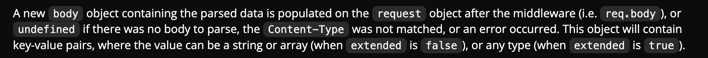
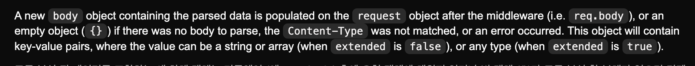

## Express ver 4 과 5 버전의 urlencoded() 처리 방식 차이

### urlencoded()
- url 인코딩된 페이로드를 가진 요청을 파싱 처리해주는 미들웨어
- 원래는 body-parser 라이브러리에 종속되어있지만 현재는 express 내장 미들웨어

### express v5 와 v4 
- express 버전에 따라 urlencoded() 메서드에서 빈 요청 페이로드를 가진 값을 처리하는 방식이 다름.
- v5 -> `undefined` 로 처리
- v4 -> `{}` 로 처리

v5 공식문서

v4 공식문서

