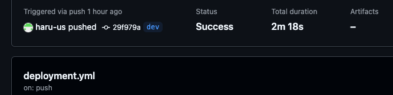
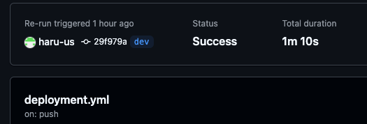

## github action 에서 docker 빌드 최적화

### docker/build-push-action 사용
- 기존에는 run 속성에서 docker 명령어를 직접 실행하는 방법
- docker cli 플러그인인 Buildx 을 사용한 `build-push-action` 액션을 사용
  - 간소화된 설정:
    - 별도의 스크립트 파일이 필요 없음
    - build args를 YAML 형식으로 깔끔하게 관리
    - Docker build와 push를 한 번에 처리

### docker build 속도 최적화

1. docker layer 줄이기
   - docker 이미지 빌드시 DockerFile 의 명령어들을 순차적으로 실행하면서 layer 생성
   - 특정 명렁어들(RUN, ADD, COPY)로 생성된 레이어는 파일 용량을 커지게 만들고, 이미지를 생성하는 시간도 길어지게 만듬

2. docker cache 사용
   - GHA( GitHub Actions) type 캐시 사용
```
   cache-from: type=gha
   cache-to: type=gha,mode=max
```
위와 같은 설정을 했을시 동작 방식
- github workflow 재실행시 캐싱처리로 빌드 속도 최적화
```
[첫 번째 빌드]
1. Dockerfile의 각 레이어 빌드
2. cache-to: type=gha로 인해 빌드된 레이어가 GitHub 캐시에 저장

[두 번째 빌드]
1. cache-from: type=gha로 인해 GitHub 캐시에서 레이어 확인
2. 변경되지 않은 레이어는 캐시에서 가져옴
3. 변경된 레이어만 새로 빌드
4. 새로운 레이어는 다시 캐시에 저장
```


**[첫번째 빌드 속도]**   


**[두번째 빌드 속도]**   

- [build-push-action](https://github.com/docker/build-push-action?tab=readme-ov-file)
- [GitHub Actions에서 도커 캐시를 적용해 이미지 빌드하기](https://arc.net/l/quote/zendwcpl)

### aws fargate 사용시 zstd 압축 알고리즘 사용을 빌드 최적화
- [zstd 압축 컨테이너 이미지를 사용하여 AWS Fargate 시작 시간 단축
  ](https://aws.amazon.com/ko/blogs/containers/reducing-aws-fargate-startup-times-with-zstd-compressed-container-images/)
