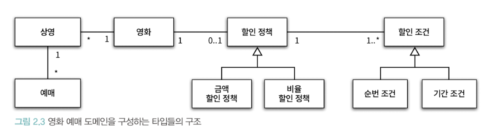
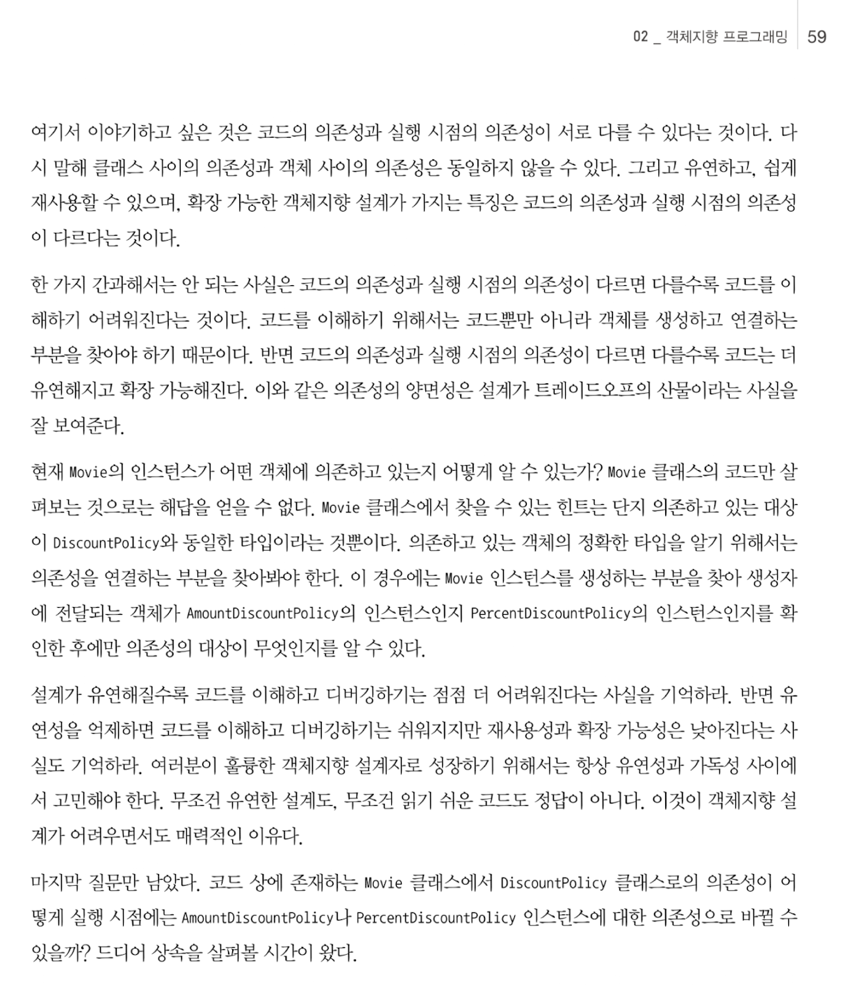
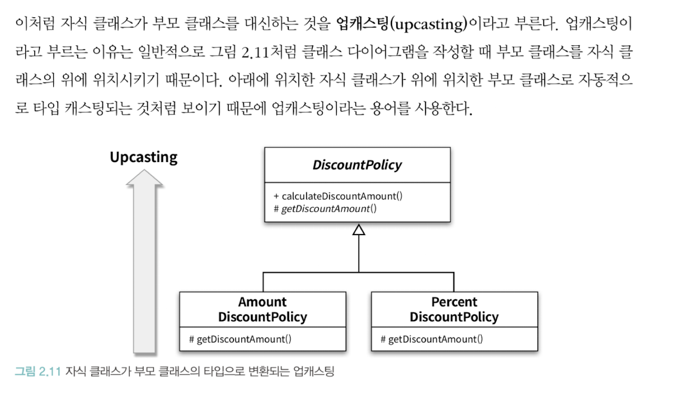
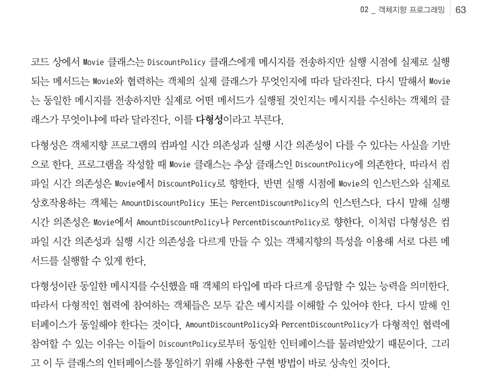
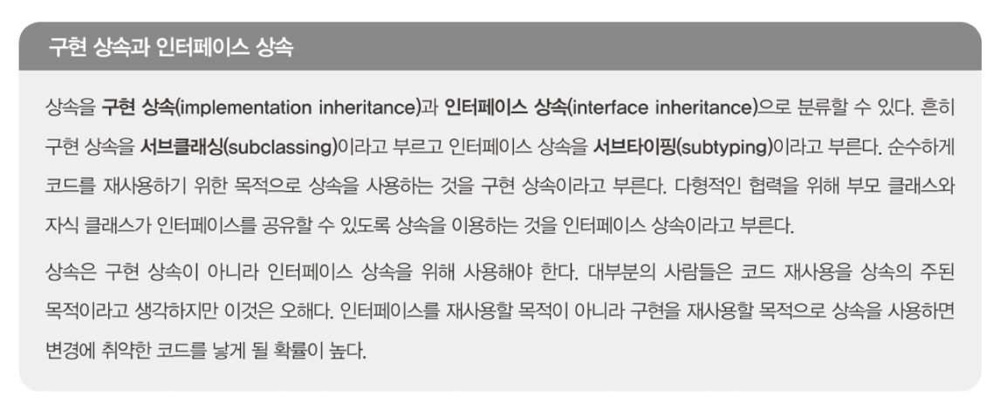
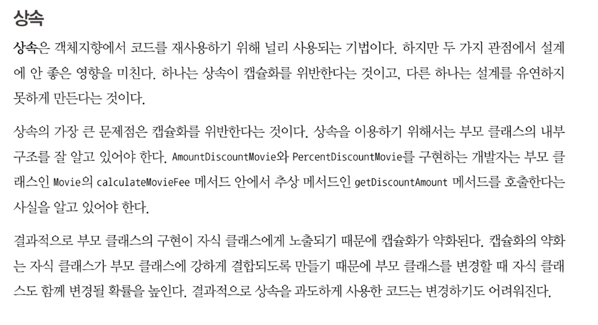

## 2장 객체 지향 프로그래밍

### 02._ 객체지향 프로그래밍을 향해

#### 도메인 구조를 따르는 프로그램 구조
```
소프트웨어는 사용자가 원하는 어떤 문제를 해결하기 위해 만들어진다.
...
이처럼 문제를 해결하기 위해 사용자가 프로그램을 사용하는 분야를 도메인이라고 부른다.
```



#### 클래스 구현하기
```
p43
그렇다면 클래스의 내부와 외부를 구분해야 하는 이유는 무엇일까?
그 이유는 경계의 명확성이 객체의 자율성을 보장하기 때문이다.

p44
자율적인 객체
객체가 자율적인 존재로 우뚝 서기 위해서는 외부의 간섭을 최소화해야 한다.
...
캡슐화와 접근 제어는 객체를 두 부분으로 나눈다.
하나는 외부에서 접근 가능한 부분으로 이를 퍼블릭 인터페이스라고 부른다.
다른 하나는 외부에서는 접근 불가능하고 오직 내부에서만 접근 가능한 부분으로 이를 구현이라고 부른다.

p45
프로그래머의 자유
객체의 외부와 내부를 구분하면 클라이언트 프로그래머가 알아야할 지식의 양이 줄어들고 클래스 작성자가
자유롭게 구현을 변경할수 있는 폭이 넓어진다.

```

#### 협력하는 객체들의 공동체
```
Money 타입처럼 저장하는 값이 금액과 관련돼 있다는 의미를 전달 할수는 없다.
또한 금액과 관련된 로직이 서로 다른 곳에 중복되어 구현되는것을 막을 수 없다.
객체지향의 장점은 객체를 이용해 도메인의 의미를 풍부하게 표현할 수 있다는 것이다.
따라서 의미를 좀 더 명시적으로 분명하게 표현할 수 있다면 객체를 사용해서 해당 개념을 구현하라.
```

#### 협력에 관한 짧은 이야익
```
객체가 다른 객체와 상호작용할수 있는 유일한 방법은 메시지를 전송하는 것 뿐이다.
...
이처럼 수신된 메시지를 처리하기 위한 자신만의 방법은 메서드라고 부른다.
```

### 03._ 할인 요금 구하기

#### 할인 정책 구성하기
```
하나의 영화에 대해 단 하나의 할인 정책만 설정할 수 있지만 할인 조건의 경우에는 여러 개를 적용할 수 있다고
했던것을 기억하는가?
Movie와 DiscountPolicy 생성자는 이런 제약을 강제한다.
```

### 04._ 상속과 다형성

#### 컴파일 시간 의존성과 실행 시간 의존성


#### 상속과 인터페이스


#### 다형성




### 05._ 추상화와 유연성

#### 상속

