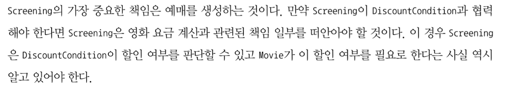
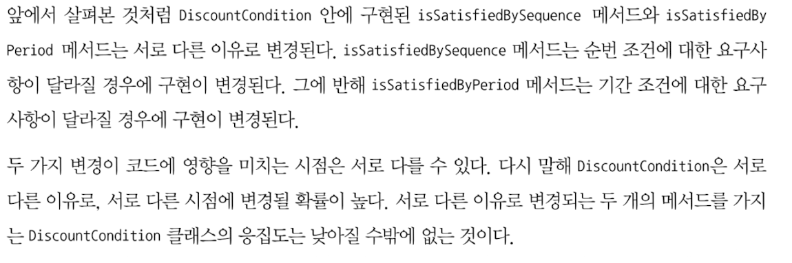
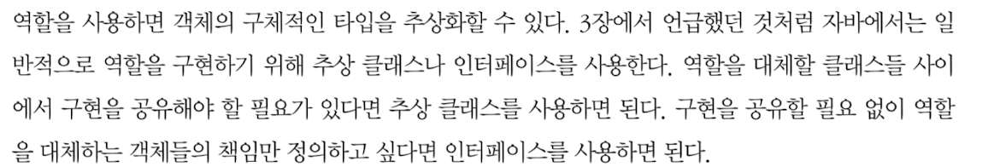
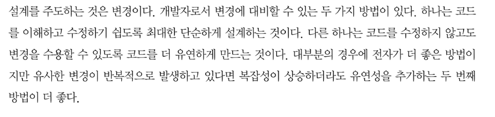
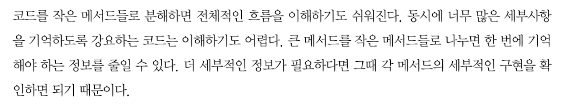

## 5장 책임 할당하기

### 서론
```
책임에 초점에 맞춰서 설계할때 직면하는 가장 큰 어려움은 ..

```

### 01. 책임 주도 설계를 향해

#### 데이터보다 행동을 먼저 결정하라
```
객체지향 설계에서 가장 중요한 것은 적절한 객체에게 적절한 책임을 할당하는 능력이다

```

#### 협력이라는 문맥 안에서 책임을 결정하라
```
P 135
책임은 객체의 입장이 아니라 객체가 참여하는 협력에 적합해야 한다.

다시 말해서 메시지를 전송하는 클라이언트의 의도에 적합한 책임을 할당해야 한다는 것이다.

P 136
메시지를 먼저 결정하기 때문에 메시지 송신자는 메시지 수신자에 대한 어떠한 가정도 할 수 없다.

```


#### 책임 주도 설계
```
책임 주도 설계의 핵심은 책임을 결정한 후에 책임을 수행할 객체를 결정하는 것이다

```

### 02 책임 할당을 위한 GRASP 패턴
#### 도메인 개념에서 출발하기
```
설계를 시작하는 단계에서 개념들의 의미와 관계가 정확하거나 완벽할 필요가 없다.

중요한것은 설계를 시작하는 것이지 도메인 개념들을 완벽하게 정리하는 것이 아니다.

```

#### 정보 전문가에게 책임을 할당하라
```
책임 주도 설계 방식의 첫 단계는 애플리케이션이 제공해야 하는 기능을 애플리케이션의 책임으로 생각하는 것이다.

> 메시지를 전송할 객체는 무엇을 원하는가?

따라서 객체에게 책임을 할당하는 첫 번째 원칙은 책임을 수행할 정보를 알고 있는 객체에게 책임을 할당하는 것이다.

정보 전문가 패턴

여기서 이야기하고 있는 정보는 데이터와 다르다는 사실에 주의하라.
책임을 수행하는 객체가 정보를 '알고' 있다고 해서 그 정보를 '저장'하고 있을 필요는 없다.

```

#### 높은 응집도와 낮은 결합도
```

P 143
DiscountCondition 이 Movie 와 협력하는 것이 좋을까, 아니면 Screening 과 협력하는 것이 좋을까?
해답의 실마리는 결합도에 있다.
```
```
P 144
```


#### 창조자에게 객체 생성 책임을 할당하라
```
CREATOR 패턴

```

### 03 구현을 통한 검증

#### DiscountCondition 개선하기
```
P 152
```


```
코드를 통해 변경의 이유를 파악할수 있는 첫번째 방법은 인스턴스 변수가 초기화되는 시점을 살펴보는 것이다.


코드를 통해 변경의 이유를 파악할수 있는 두번째 방법은 메서드들이 인스턴스 변수를 사용하는 방식을 살펴보는 것이다.
```

#### 타입 분리하기

#### 다형성을 통해 분리하기



#### 변경으로부터 보호하기

#### Movie 클래스 개선하기

#### 변경과 유연성


### 04. 책임 주도 설계의 대안

#### 메서드 응집도
```
P 168
...몬스터 메서드라고 부른다.
```



