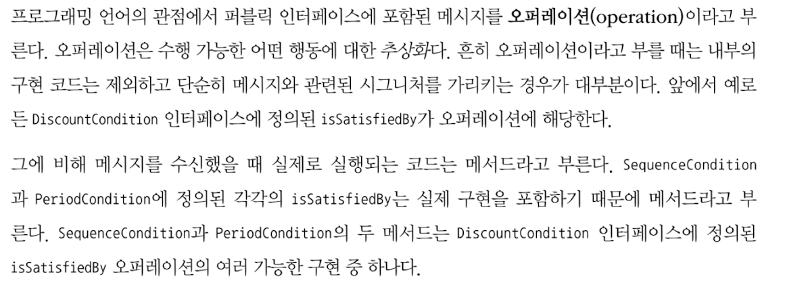
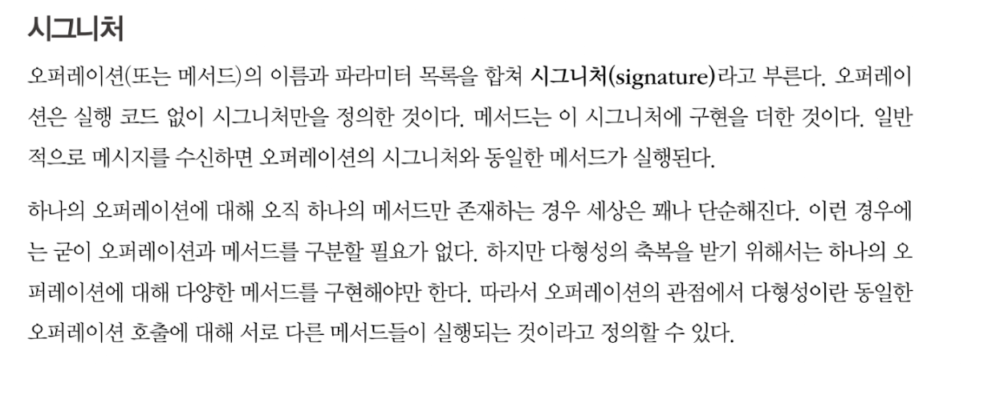
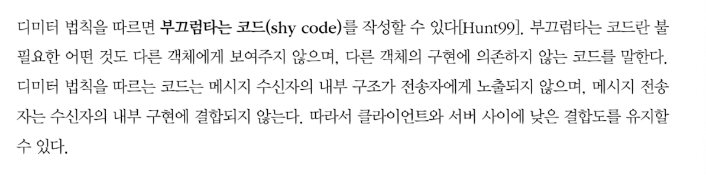
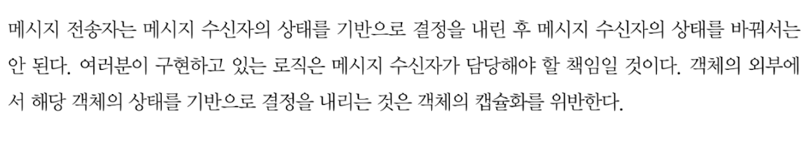
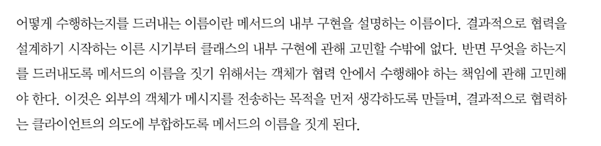
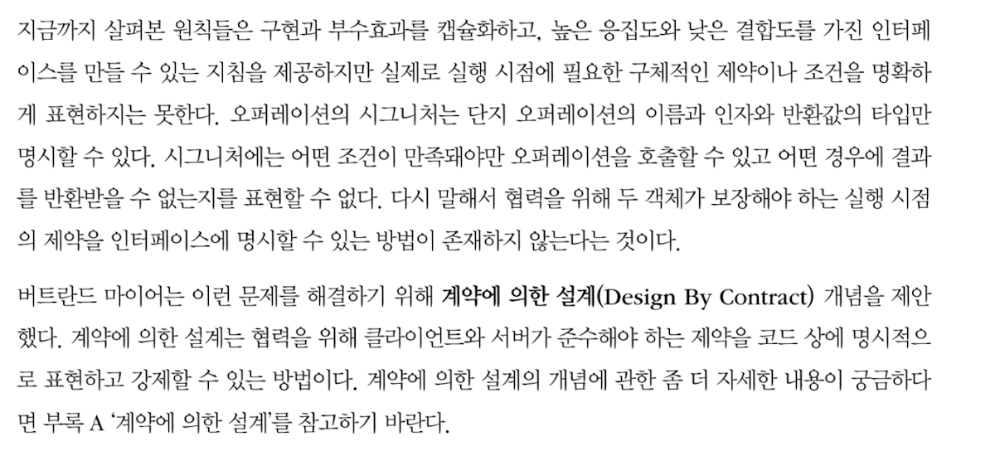

## 6장 메시지와 인터페이스

### 서론
```
훌룽한 퍼블릭 인터페이스를 만드는데 도움이 되는 설계 원칙과 기법을 익히는 .. 
```


### 01. 협력과 메시지


#### 클라이언트-서버 모델


#### 메시지와 메시지 전송
```
```

#### 메시지와 메서드
```
```

#### 퍼블릭 인터페이스와 오퍼레이션


#### 시그니처


### 02. 인터페이스와 설계 품질

#### 디미터 법칙


#### 묻지 말고 시켜라


#### 의도를 드러내는 인터페이스


### 03. 원칙의 함정


### 04. 명령-쿼리 분리 원칙

#### 명령-쿼리 분리와 참조 투명성

#### 책임에 초점을 맞춰라



