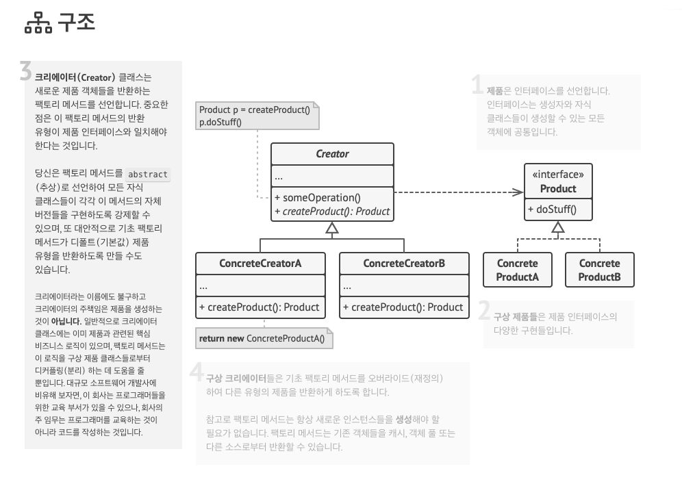

# 생성자 패턴 과 DI

## 스터디 책 내용 정리

### 팩토리
팩토리 메서드 패턴은 new 연산자로 객체를 생성하는 역할을 하는 인터페이스를 정의한후 서브클래스에서 인스턴스를 만드는 패턴이다.

팩토리 메서드 패턴 [출처.refactoring.guru](https://refactoring.guru/ko/design-patterns/factory-method)

객체의 구조 및 생성 과 객체 그자체를 분리하여(디커플링) 객체 생성을 캡슐화 하는게 주 목적이다.

구현 클래스의 팩토리 메서드가 실제 객체 생성을 담당하지면 반환 유형은 일반적으로 추상 클래스 또는 인터페이스로 선언한다.

### 빌더
빌더 패턴은 복잡한 객체의 생성 과정과 표현 방법을 분리하여 동일한 생성 절차에서 서로 다른 표현 결과를 만들 수 있게 하는 패턴이다.
단순한 객체 생성일때는 과하지만 복잡한 객체를 만들때는 단순화해준다.

- 객체 생성을 위해 너무 많은 매개변수가 필요한 경우 빌더 패턴이 적합하다.
- RORO패턴을 통해 하나의 객체 리터럴로 관리할수 있지만 가독성도 떨어진다.

### 싱글톤
싱글톤 패턴은 클래스에 인스턴스를 한번만 생성후 어디서든지 접근할 수 있게 하는 패턴이다.
- 메모리 효율성
- 자원 공유에 대한 side effect 고려

nodejs에서는 module를 로드할때 이미 캐시된 상태기 때문에 싱글톤 패턴을 사용하지 않아도 된다. ([nodejs module cache](https://nodejs.org/api/modules.html#modules_caching))

