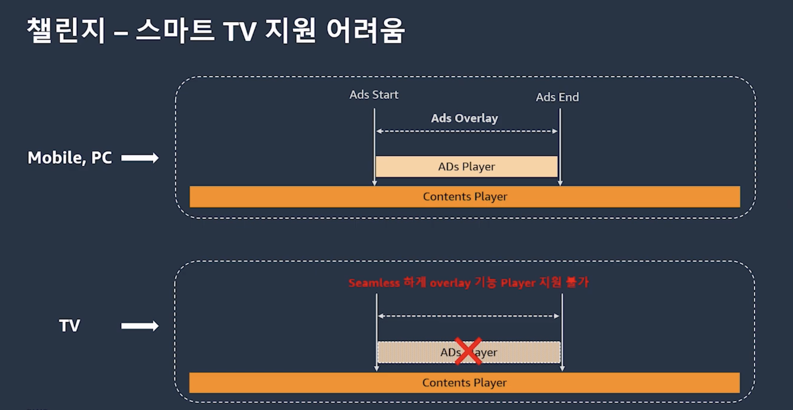

# 클라우드로 진화하는 스마트 TV 광고 - 티빙의 AWS Elemental 서비스 활용기

https://youtu.be/_CNC0l31Z_s?si=mzCS7dAqkp17FyeL

## AWS 미디어 서비스 기반 서버 사이드 광고 아키텍처 개요

### AWS Elemental 미디어 서비스 소개

aws elemental 미디어 서비스를 활용한 라이브 서비스 광고 삽입 아키텍처를 설명하며, 세 가지 핵심 서비스(MediaLive, MediaPackage, MediaTailor)를 소개합니다.

1. **AWS Elemental MediaLive (클라우드 기반 실시간 인코딩 미디어 서비스)**

    1. **역할**: 매우 큰 원본 데이터를 각 디바이스에 맞게 압축하여 전달할 수 있는 사이즈로 만드는 역할을 수행합니다.
    2. **지원 범위**: 넓은 범위의 미디어 기술 스탠더드(다양한 코덱, 프로토콜, 이머시브 기술)를 지원하여 쉽게 기술을 적용할 수 있습니다.
    3. **안정성**: 방송사 수준의 안정성을 제공합니다.
        1. 입력 신호 및 내부 파이프라인에 대한 **이중화**가 처리되어 있어, 한 입력 신호 실패 시 다른 신호로 **자동 페일오버**가 가능합니다.
    4. **관리 용이성**: 여러 라이브 채널 생성 시 필요한 리소스 관리를 AWS 자체에서 수행하므로, 쉬운 설정과 관리로 채널을 생성 및 관리할 수 있습니다.
2. **AWS Elemental MediaPackage (클라우드 기반 패키징 미디어 서비스)**

    1. **포맷 지원**: HLS, DASH, MSS, MMS 등 널리 사용되는 스트리밍 미디어 포맷을 지원합니다.
    2. **보안**: DRM 콘텐츠 보안 패키징을 제공하며, Apple FairPlay, Widevine, Microsoft PlayReady 등 다양한 DRM 서비스를 적용하여 멀티 디바이스 지원이 가능합니다.
    3. **구조**: 내부 다이어그램은 인제스트, 패키징, 캐싱 부분으로 나누어져 있으며, 각 부분은 다중화되어 **확장성 및 자동 페일오버**가 가능하여 신뢰성을 제공합니다.
3. **AWS Elemental MediaTailor (클라우드 기반 서버 사이드 광고 삽입 서비스)**

    1. **표준 지원**: IAB 표준 기술인 VAST, VMAP, FreeWheel을 지원하여 모든 플랫폼에 **타겟팅 광고를 손쉽게 전달**할 수 있으며, 다양한 광고 플랫폼과 연동이 가능합니다.
    2. **시청자 경험 개선**: 메인 콘텐츠와 **동일한 형태로 광고 자산을 내부적으로 인코딩**하여 포맷을 맞춰 매끄러운 재생 경험을 제공합니다.
    3. **서버 사이드 특징**: 하나의 스트림에 메인 콘텐츠와 광고 자산이 동시에 전달되므로, 새로운 광고 로딩 시 발생하는 **버퍼링이 필요 없습니다**.
    4. **보고 옵션**: 서버 사이드 측에서 측정한 결과를 애드 디시전 서버(광고 결정 서버)에 전달할 수 있어, 다양한 디바이스에서 **특별한 개발 없이 추적 지원이 가능**합니다.

### 서버 사이드 개인화 광고 연동 방식 설명

서버 사이드 개인화 광고 삽입 및 교체가 광고 서버와 연동되는 방식을 간략하게 설명합니다.

1. 시청자들이 메인 영상을 요청할 때, 각 사용자마다 **별도로 구분된 세션**을 통해 영상이 전달됩니다.
2. 광고가 들어가야 할 시점(파란색 부분)에 **MediaTailor**는 해당 시점에 **애드 디시전 서버와 연동**하여 각 사용자에게 다른 광고를 전달할 수 있습니다.

## 티빙의 광고 시스템 변천사 및 서버 사이드 전환 배경

### 기존 클라이언트 사이드 광고 시스템의 문제점

광고 수요 증가에 따라 기존 광고 시스템과 새로운 시스템을 소개하는 자리가 마련되었습니다.

1. **기존 시스템**: 클라이언트 사이드 광고였습니다.

    1. 브랜드 및 APC 데이터가 광고 운영 서버로 입력되면, 광고 운영 서버는 라이브 오리진으로 **RTMP/AMF 데이터**를 송출합니다.
    2. 라이브 오리진은 HLS 서비스를 위해 패키징하면서 스트림 내에 **ID3 태그를 삽입**하여 광고를 서비스했습니다.
    3. 광고 타이밍 시, 클라이언트는 광고 결정 서버(광고 서버)로 로드 밸런싱하는 프록시 서버를 통해 **REST 형태**로 광고를 요청합니다.
    4. 광고 결정 서버는 클라이언트에게 광고 정책을 응답하고, 클라이언트 SDK는 이를 파싱하여 실제 광고 서버로 광고를 요청합니다.
    5. 광고 서버는 **VAST 규격**으로 광고를 응답하고, 클라이언트는 응답 내 광고 소재 경로를 참조하여 스토리지를 통해 딜리버리합니다.
2. **가장 큰 허들**: **스마트 TV 지원의 어려움**이었습니다.

    1. 모바일/PC 환경에서는 콘텐츠 재생 중 광고 듀레이션만큼 **별도 플레이어를 오버레이**하여 광고를 플레이할 수 있었습니다.
    2. 하지만 TV에서는 구조적으로 심리스하게 오버레이할 수 있는 플레이어를 띄우는 것이 불가능하여 광고 서비스가 어려웠습니다.

**전환 결정**: 클라이언트 의존성이 높은 클라이언트 사이드 광고 대신, **서버 사이드에서 광고를 컨트롤**할 방안을 고민했고, MediaTailor를 포함한 AWS 미디어 서비스를 이용하여 아키텍처를 구성했습니다.

## 티빙의 서버 사이드 광고 아키텍처 상세 흐름

티빙이 구축한 서버 사이드 광고 아키텍처의 구체적인 작동 방식과 연동 과정을 설명합니다.

### 서버 사이드 광고 기본 흐름

1. 광고 운영 서버는 광고 삽입/제거 요청을 **API 형태**로 MediaLive로 전송합니다. 
2. 이후 MediaLive, MediaPackage, MediaTailor를 거쳐 HLS 스트림을 통해 **광고 마커가 딜리버리**되어 클라이언트에게 광고가 서비스됩니다. 
3. **광고 결정 서버의 역할 대체**: 기존 클라이언트 SDK가 하던 광고 결정 서버 응답 파싱 및 광고 서버 요청 역할을 **MediaTailor가 대체**합니다. 
4. 광고 타이밍 시 MediaTailor는 광고 결정 서버로 **REST 형태**로 광고를 요청합니다. 
5. 광고 결정 서버는 정책에 맞게 광고 서버로 광고를 요청하고, 광고 서버는 **VAST 규격**으로 광고 결정 서버 및 MediaTailor까지 응답합니다. 
6. MediaTailor는 이 요청을 파싱하여 **광고 소재를 딜리버리**하는 구조입니다.  
7. 클라이언트가 콘텐츠를 재생할 경우 MediaLive, MediaPackage를 통해 콘텐츠 세그먼트가 재생됩니다.  
8. 광고 타이밍이 되면, 앞선 프로세스를 통해 MediaTailor까지 광고 소재가 도달하고, MediaTailor가 매니페스트 내 **콘텐츠 세그먼트를 광고 세그먼트로 교체**하여 클라이언트에게 서비스합니다.  

### 주요 연동 상세 프로세스

앞서 설명한 프로세스 중 두 가지를 더 자세히 설명합니다.

1. **광고 운영 서버와 MediaLive 간의 연동**
    1. 광고 운영 서버는 광고 삽입 또는 제거 요청 시 **스프라이스 인서트(Splicing Insert), 광고 지속 시간, 채널 ID 정보**를 MediaLive로 API 형태로 요청합니다.
    2. MediaLive는 이 정보를 기반으로 광고 삽입 또는 제거에 대한 **스케줄을 생성하고 실제 동작을 수행**합니다.
2. **광고 결정 서버와 MediaTailor 간의 연동**
    1. 광고 타이밍 시 MediaTailor는 광고 결정 서버로 **디바이스 타입, 타겟팅 유무, 광고 지속 시간, 사용자 에이전트, 세션 ID 정보**를 쿼리 형태로 요청합니다.
    2. 광고 결정 서버는 내부 정책을 조회하여 정책에 맞는 광고 서버로 광고를 요청합니다.
        1. 사전에 정의된 정책에는 요청이 들어왔을 때 **어떤 광고 서버로, 어느 정도 비율로 요청을 보낼지**에 대한 내용이 담겨 있습니다.
    3. 광고 결정 서버가 광고 서버로 요청을 보낼 때에도 사용자의 **디바이스 타입, 시청 중인 프로그램/채널 정보, 성별과 같은 개인화된 정보**를 동일하게 쿼리 형태로 전송합니다.
    4. 광고 서버는 이러한 개인화된 정보를 기반으로 광고 결정 서버, MediaTailor에게 **VAST 규격**으로 광고를 응답합니다.

## 광고 서버 부하 절감 및 정확한 타이밍을 위한 프리패칭 전략

서버 사이드 광고 적용 시 정확한 타이밍 노출과 광고 서버 부하 절감을 위한 프리패칭(Pre-fetching) 전략을 설명합니다.

### 프리패칭의 개념 및 동작 구분

프리패칭은 **리트리벌(Retrieval)**과 **컨섬션(Consumption)** 두 가지 동작으로 구분됩니다.

1. **리트리벌**: 특정 기간 동안 광고 서버로부터 광고 소재를 가져와 **MediaTailor에 광고 소재를 캐싱**하는 동작을 의미합니다.
2. **컨섬션**: 리트리벌된 광고 소재를 클라이언트에게 **실제로 적용**하는 동작을 의미합니다.

### 캐싱 키 및 부하 절감 원리

1. **동적 변수 활용**: 리트리벌 시 **키-밸류 형태의 동적 변수**를 설정할 수 있으며, 이 변수는 광고 결정 서버로 광고를 전달하고 MediaTailor로 캐싱할 때 **캐시 키로 활용**됩니다.
2. **컨섬션 매칭**: 컨섬션 그래프에서는 리트리벌에 설정된 키 형태의 동적 변수와 **정확하게 매칭된 정보**를 설정할 수 있으며, 이는 동일한 캐시 키를 가진 광고 소재를 클라이언트에게 응답한다는 의미입니다.
3. **사전 트랜스코딩 및 캐싱**: 광고 타이밍 시 MediaTailor가 광고 결정 서버에 광고 듀레이션을 보내면, 광고 결정 서버는 해당 듀레이션을 참조하여 응답할 광고 소재 리스트를 **VAST 규격**으로 MediaTailor에 응답합니다.
4. **부하 절감**: 클라이언트는 광고 요청 시 모든 요청을 광고 서버로 보내지 않고, MediaTailor에 캐싱된 광고 소재를 응답함으로써 **실질적으로 광고 서버로의 부하를 절감**할 수 있습니다.

## 수동 광고 삽입 시 발생한 엔드투엔드 딜레이 문제 해결

라이브 서버 사이드 광고 적용 중 마주친 난관 중 하나인 '수동 광고' 삽입 시 발생한 지연 문제와 해결 과정을 설명합니다.

### 수동 광고와 최대 20초 지연 현상

1. **수동 광고 정의**: 야구 중계처럼 **정확한 APC 정보 없이 운영자가 수동으로 광고를 삽입하고 제거**하는 독특한 형태의 광고입니다.
2. **문제 발생**: 불규칙한 수동 광고 삽입/제거 동작을 반복할 경우, 광고 삽입 이후 **엔드투엔드 딜레이가 데이터 기준으로 최대 20초 이상**까지 벌어지는 현상이 목격되었습니다.
3. **지연 원인**:
    1. 광고 삽입 시 **명확한 광고 듀레이션을 주지 않은 것**이 원인이었습니다.
    2. 광고 듀레이션 전에 **IN(광고 시작)을 강제로 삽입**하는 것이 원인이었습니다.
    3. MediaLive는 IN부터 OUT까지 광고 듀레이션만큼 콘텐츠 세그먼트를 본래 TS 듀레이션보다 **짧게 나누게 됩니다**.
    4. 광고 세그먼트는 콘텐츠와 달리 실시간으로 세그먼트되지 않기 때문에, 광고 재생 중에 강제 종료하더라도 **광고를 모두 재생**하게 됩니다.
    5. 클라이언트는 광고를 모두 재생한 후, 앞서 짧게 나누어진 TS 듀레이션을 재생하는 구조가 반복 누적되어 전체 지연이 최대 20초 이상 발생했습니다.

### 지연 현상 해결 방안 적용

이러한 현상의 조건은 명확히 존재했습니다.

1. **해결 조건**: 큐레이션을 명시적으로 지정하여 애드 브레이크를 생성하는 것과, 강제로 시간을 넣지 않는 것이었습니다.
2. **적용 조치**:
    1. **명시적으로 큐레이션을 삽입**했습니다.
    2. 서비스 특성, 환경, 상황에 맞게 **유동적으로 듀레이션을 지정**했습니다.
3. **결과**: 이러한 조치를 통해 최대 20초 이상 벌어지던 지연을 **어느 정도 보정하는 효과**를 거둘 수 있었습니다.

## 서버 사이드 광고 적용을 통한 긍정적 효과 및 향후 목표

라이브 환경에서 서버 사이드 광고를 적용하며 얻은 긍정적인 효과와 향후 계획을 설명합니다.

### 서버 사이드 광고 도입의 긍정적 효과

1. **신규 디바이스 광고 노출 확대**: 기존 클라이언트 사이드 광고의 가장 큰 허들(스마트 TV 지원 어려움)을 극복하고, **신규 디바이스에서의 광고 노출을 확대**할 수 있었습니다.
    1. TV뿐만 아니라 Apple TV, AirPlay 같이 **멀티 인스턴스를 띄워야 하는 환경**에도 광고 서비스가 가능해졌습니다.
2. **클라이언트 의존성 제거**: 클라이언트별 별도 SDK가 아닌 **단일의 광고 결정 서버만으로 광고를 컨트롤**할 수 있게 되어 클라이언트 의존성을 제거했습니다.
    1. 클라이언트와 광고 서버 간의 간헐적 통신 실패나 클라이언트 단에서의 **임의적인 애드 블록 환경에서도 광고 서비스가 가능**해졌습니다.
3. **시청 경험 향상**: 콘텐츠와 광고 시청에 대한 **사용자 시청 경험이 향상**되었습니다.
