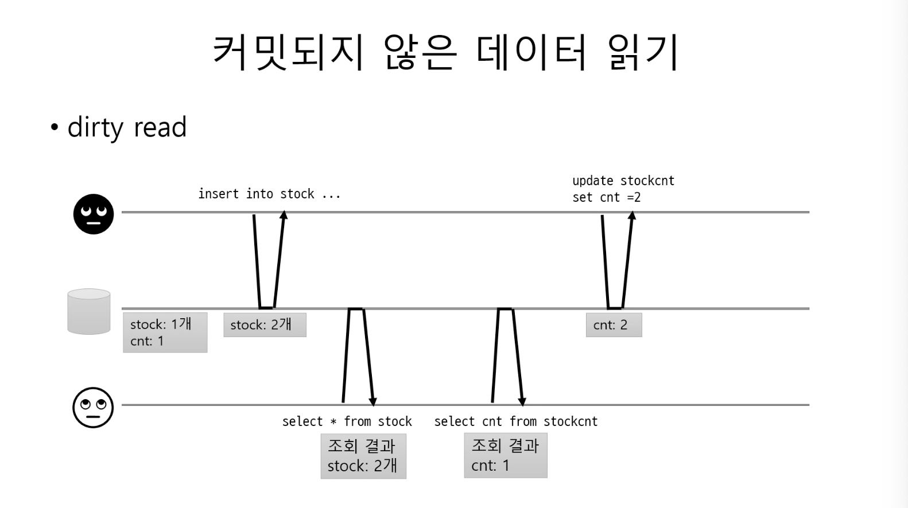
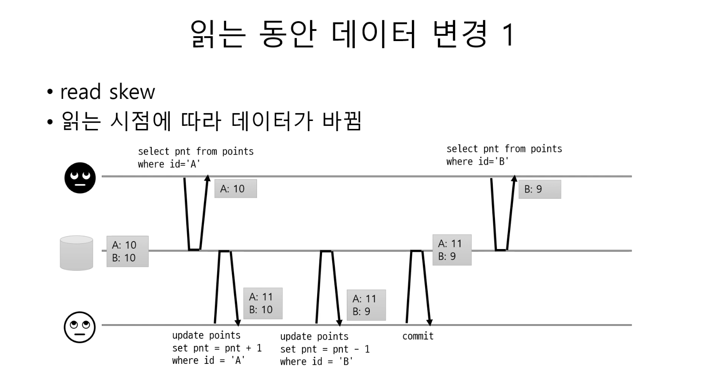
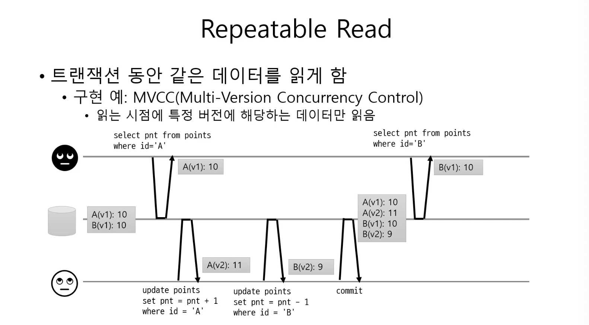
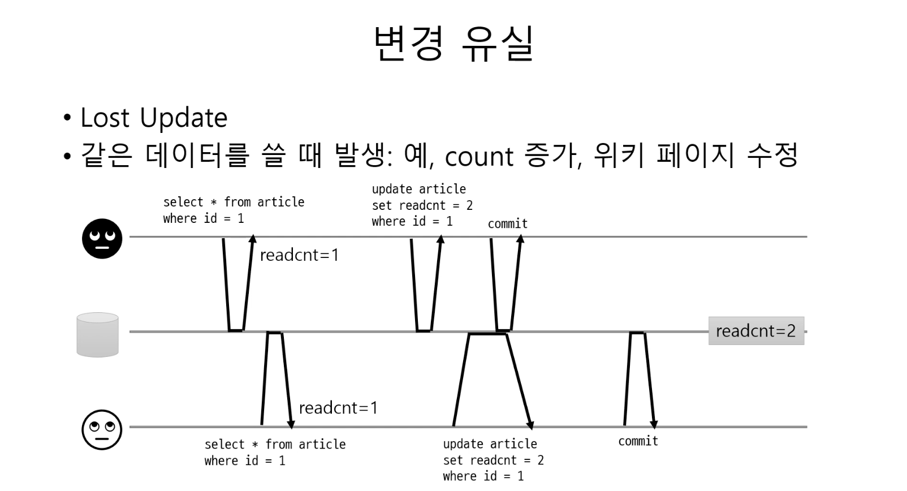
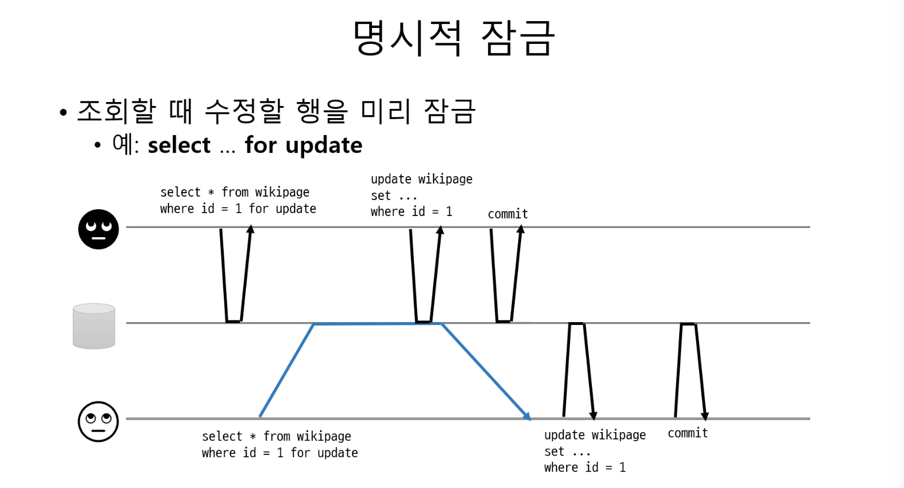
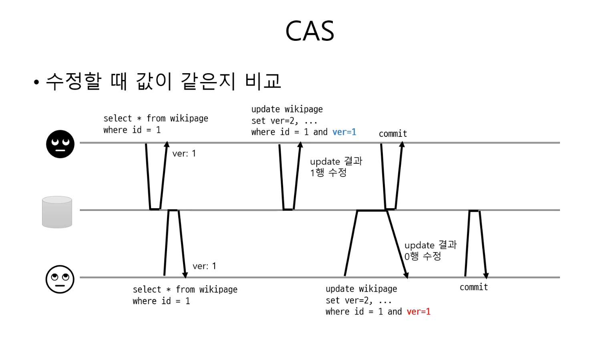
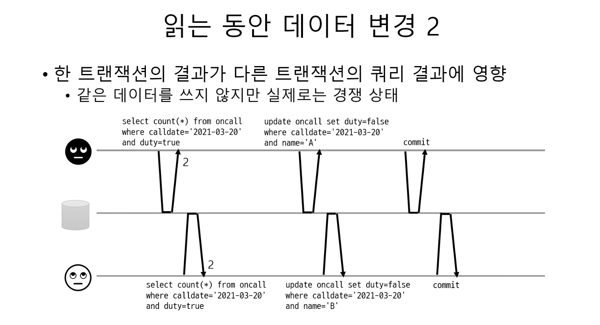

# 트랜잭션

## 정의 

## ACID
### 원자성
- 여러 읽기, 쓰기 작업이 하나의 원자적인 트랜잭션으로 묶여 결함에 대한 최종 완료(커밋) 또는 취소(어보트)되어지는 성질
- 오류가 생겼을때 트랜잭션을 어보트하고 해당 트랜잭션에서 기록한 모든 내용을 취소하는 성질 == 어보트 능력
- 부분 취소의 결과가 나타나지 않도록 전부 반영 or 전부 실패

### 일관성
- 데이터베이스의 규칙(제약 조건)을 유지시키면서 애플리케이션의 로직을 통해 일관성을 처리하는 성질 (데이터베이스 + 애플리케이션 책임)

### 격리성
- 동시에 실행되는 트랜잭션을 서로 격리하는 성질 (동시성 제어)
- 두 클라이언트가 하나의 데이터베이스의 데이터를 업데이트 할때 발생하는 경쟁 조건의 문제를 해결
- isolation level이 존재

### 지속성
- 성공적으로 트랜잭션 커밋이 됬을시 데이터베이스에 영구적으로 저장 및 유실 방지 보장

## 격리
- 여러 클라이언트가 같은 데이터에 접근할때 발생하는 경쟁 상태(race condition)를 막기 위해 격리
- 트랜잭션을 서로 격리해서 다른 트랜잭션이 영향을 주지 못하게 함

### Read Uncommitted
- Dirty Read 발생
  - 커밋되지 않은 데이터를 조회
- Dirty Write 발생
  - 커밋되지 않은 데이터를 쓰기

### Read Committed
- Dirty Read & Write 방지
  - 커밋된 데이터만 조회 
    - 커밋되어진 값과 트랜잭션 진행중인 값을 분리하여 커밋되어진 값만 조회
  - 커밋된 데이터만 쓰기
    - 레코드 단위로 잠금 사용
- Read Skew 발생 가능
  - 하나의 트랜잭션이 같은 쿼리를 두 번 실행했을 때 다른 결과가 조회되는 현상

### Repeatable Read
- 트랜잭션마다 트랜잭션 ID를 부여하여 트랜잭션 ID보다 작은 트랜잭션 번호에서 변경한 것만 읽음
- MVCC 방식

- Lost Update 발생 가능
  - 두 개의 트랜잭션이 같은 데이터를 수정할 때 발생하는 문제 ex) count 증가, 위키 페이지 수정

- 변경 유실을 막는 방법
  - 원자적(atomic) 연산
    - DB가 지원하는 원자적 연산 사용 
    - `UPDATE ... SET count = count + 1`
  - 명시적 잠금
    - 조회할때 수정할 행을 잠금
    - `SELECT ... FOR UPDATE`

 

  - CAS
    - Compare And Swap

- Phantom Read 발생 가능
  - 한 트랜잭션의 결과가 다른 트랜잭션에 영향을 주는 현상
  - 서로 다른 데이터를 변경함으로써 발생하는 문제

    

### Serializable
- 가장 단순한 격리 수준이지만 가장 엄격한 격리 수준
- 일관성이 보장되지만 성능이 가장 떨어짐
- 인덱스 또는 조건 기반 잠금을 사용

## MySQL & PostgreSQL

### MySQL
- 기본 격리 수준 : Repeatable Read
- Lost Update 발생시 해결 방안
  - 명시적 잠금 (locking read)
    - `SELECT ... FOR UPDATE`
    - `SELECT ... LOCK IN SHARE MODE`

### PostgreSQL
- 기본 격리 수준 : Read Committed
- Lost Update 발생시 해결 방안
  - Repeatable Read로 격리 수준 변경
    - first-updater-win 적용
    - 같은 데이터에 먼저 update한 tx가 commit되면 나중에 update한 tx는 rollback된다.
    - 데이터의 일관성 보장

> 이미 다른 동시 트랜잭션에 의해 업데이트(또는 삭제 또는 잠김)되었을 수 있습니다.  
이 경우 Repeatable Read는 첫 번째 업데이트 트랜잭션이 커밋되거나 롤백될 때까지 기다립니다(아직 진행 중인 경우).   
첫 번째 업데이터가 롤백되면 그 효과는 무효화되고 Repeatable Read 트랜잭션은 원래 발견된 행을 계속 업데이트할 수 있습니다.    
그러나 첫 번째 업데이터가 커밋하면(그리고 단순히 잠근 것이 아니라 실제로 행을 업데이트하거나 삭제하면) Repeatable Read 트랜잭션은 아래와 같은 메시지와 함께 롤백됩니다.
> > ERROR:  could not serialize access due to concurrent update
>
> [PostgreSQL 공식 문서](https://www.postgresql.org/docs/9.5/transaction-iso.html)
