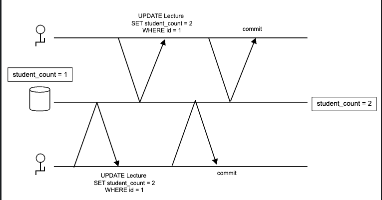
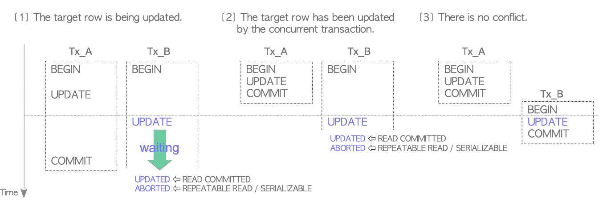

## [PostgreSQL & MySQL] Lost Update 상황에서 어떻게 동작할까?

> Lost Update 
> 
> 데이터베이스에서 발생할 수 있는 문제 중 하나로, 동시에 두 개 이상의 트랜잭션이 동일한 데이터를 수정하고 있는 경우 먼저 저장한 트랜잭션이 나중에 저장한 트랜잭션에 의해 덮어씌워져 버리는 상황이 발생해 처음 수정한 내용을 알지못하는 상황 



MySQL과 PostgreSQL 두 DB 엔진은 위 상황과 같은 lost update를 어떻게 처리할까?


### 테스트
- mysql, postgresql 두 db 엔진 준비

- 테이블 생성 및 테스트 데이터 삽입


```sql
CREATE TABLE user (
id INT NOT NULL AUTO_INCREMENT,
email VARCHAR(255) NOT NULL,
name VARCHAR(255) NOT NULL,
PRIMARY KEY(id)
);

INSERT INTO user (email, name) VALUES ('email', 'name');
```
- **트랜잭션 격리 수준 REPEATABLE_READ 로 설정**

- 두 트랜잭션이 시작된후 update 쿼리 수행

A 트랜잭션
```sql
START TRANSACTION;
update user set email = 'new email 1' where name = 'name';
```
B 트랜잭션
```sql
START TRANSACTION;
update user set email = 'new email 2' where name = 'name';
```
- A 트랜잭션 commit

- B 트랜잭션 commit

### MySQL 결과
- A 트랜잭션 commit 후 B 트랜잭션 commit 이 되어 email 값이 최종적으로 new email 2 되어짐.

### PostgreSQL 결과
- A 트랜잭션 commit 후 B 트랜잭션을 commit 하려고 하면 아래의 에러 발생
```
ERROR: could not serialize access due to concurrent update
```
**First-Updater-Win**
- 행을 기준으로 먼저 커밋된 트랜잭션으로 인해 행의 데이터가 변경되었을시 커밋되지 못하고 롤백이 된다.

