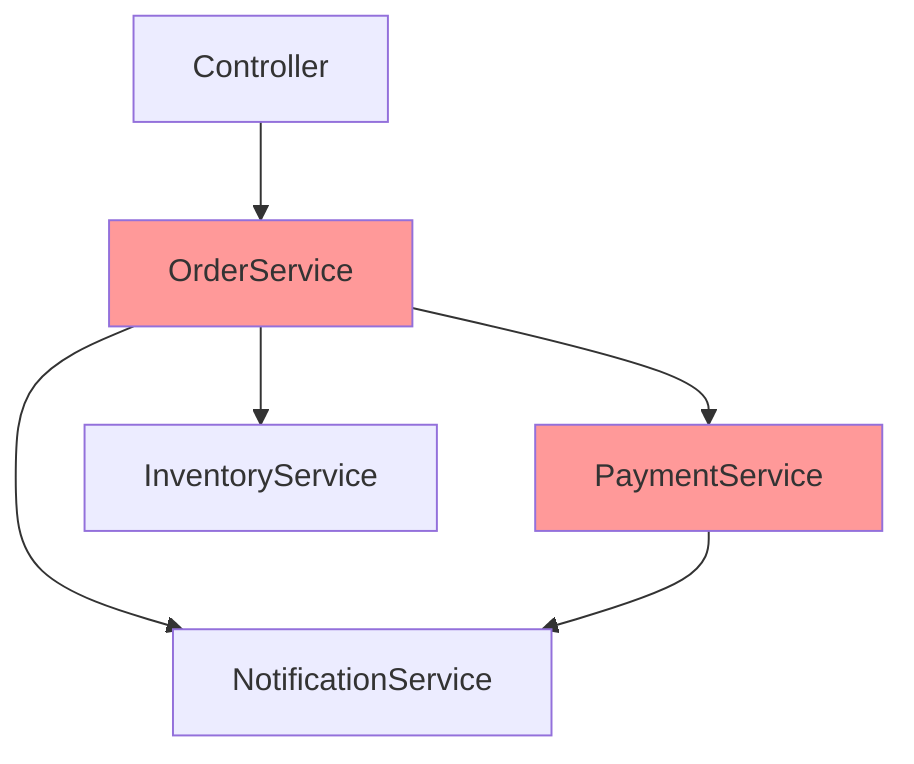
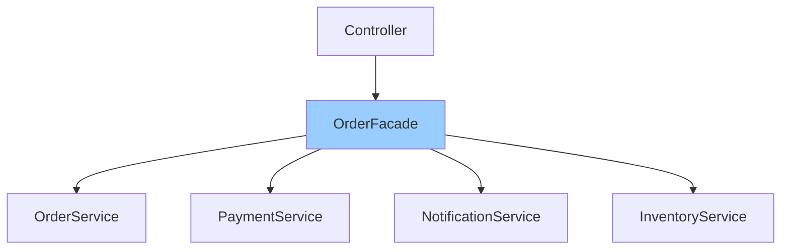

# Facade 패턴과 Facade 계층

## GoF Facade 패턴

Facade 패턴은 GoF(Gang of Four) 디자인 패턴 중 구조 패턴에 해당하며, 복잡한 서브시스템에 대한 **단순화된 인터페이스**를 제공하는 것이 목적이다.

```
클라이언트 ──▶ Facade ──▶ 서브시스템 A
                    ├──▶ 서브시스템 B
                    └──▶ 서브시스템 C
```

- 클라이언트는 서브시스템의 내부 구조를 알 필요 없이 Facade가 제공하는 인터페이스만 사용한다.
- 서브시스템 간의 결합도를 낮추고, 사용 편의성을 높인다.

이 문서에서 다루는 **Facade 계층**은 GoF Facade 패턴의 사상을 아키텍처 레이어에 적용한 것이다. 여러 도메인 서비스를 조합하는 계층을 별도로 분리하여, 서비스 간의 복잡한 의존 관계를 단순화하고 단방향 의존성을 유지한다.

---

## Facade 계층이란

Facade 계층은 Controller와 Service 사이에 위치하여 **여러 서비스의 조합과 오케스트레이션을 담당하는 계층**이다.

```
Controller → Facade → Service → Repository
```

### 도입 배경

서비스 계층만으로 애플리케이션을 구성하면 다음과 같은 문제가 발생한다.

1. **서비스 간 암묵적 상하관계**: `OrderService`가 `PaymentService`와 `NotificationService`를 직접 의존하면, 서비스 간에 암묵적인 상하관계가 형성된다. 이는 도메인 서비스가 다른 도메인 서비스를 의존하여 계층 구조가 불명확해지는 원인이 된다.
2. **순환 의존 위험**: 서비스 간 직접 의존이 늘어나면 A → B → C → A 형태의 순환 의존이 발생할 수 있다.
3. **단일 책임 위반**: 하나의 서비스가 자신의 도메인 로직과 다른 서비스의 조합 로직을 동시에 담당하게 된다.
4. **테스트 어려움**: 서비스가 여러 다른 서비스를 의존하면 단위 테스트 시 많은 Mock 설정이 필요하다.

Facade 계층을 도입하면 서비스 조합 책임을 Facade로 분리하여, 도메인 서비스는 자신의 핵심 로직에만 집중할 수 있다.

---

## 의존성 방향 비교

### Facade 도입 전

서비스가 다른 서비스를 직접 의존하면서 양방향 또는 복잡한 의존 관계가 형성된다.



- `OrderService`가 여러 도메인 서비스를 직접 의존한다.
- `PaymentService`도 `NotificationService`를 의존하여 의존 관계가 복잡해진다.
- 어떤 서비스가 상위이고 어떤 서비스가 하위인지 구분이 모호하다.

### Facade 도입 후

Facade가 조합 책임을 가지고, 각 도메인 서비스는 독립적으로 동작한다.



- 도메인 서비스 간에 직접 의존이 없다.
- 모든 의존성이 **단방향(Controller → Facade → Service → Repository)** 으로 흐른다.
- 서비스 추가/제거 시 Facade만 수정하면 되므로 변경 영향 범위가 명확하다.

---

## Facade 계층의 책임과 규칙

### Facade에 들어가야 할 것

| 항목 | 설명 |
|------|------|
| 서비스 조합 | 여러 도메인 서비스의 메서드를 호출하고 결과를 조합한다 |
| 오케스트레이션 | 서비스 호출 순서와 흐름을 제어한다 |
| 트랜잭션 관리 | 여러 서비스에 걸친 트랜잭션 경계를 설정한다 |
| 외부 호출 조합 | HttpService(axios) 등 외부 API 호출 서비스를 조합한다 |
| 이벤트 발행 | EventEmitter2 등을 통한 이벤트 발행 로직을 담당한다 |

### Facade에 들어가면 안 되는 것

| 항목 | 설명 |
|------|------|
| 핵심 비즈니스 로직 | 도메인 규칙, 계산, 검증은 도메인 서비스에 위치해야 한다 |
| 데이터 접근 로직 | Repository 호출은 서비스 계층에서 처리한다 |
| 엔티티/도메인 객체 조작 | 도메인 객체의 상태 변경은 서비스 또는 도메인 객체 내부에서 처리한다 |

### 규칙 정리

1. **Facade는 서비스를 조합만 한다**: Facade 내부에 비즈니스 판단 로직이 있으면 안 된다. Facade는 "무엇을 호출할지"를 결정하고, "어떻게 처리할지"는 각 서비스에 위임한다.
2. **도메인 서비스는 단일 책임을 갖는다**: 각 서비스는 자신의 도메인에 대한 로직만 담당하고, 다른 도메인 서비스를 의존하지 않는다.
3. **Facade는 다른 Facade를 호출하지 않는다**: Facade 간 의존이 생기면 계층 분리의 의미가 퇴색된다.
4. **Controller는 Facade 또는 단일 Service를 호출한다**: 조합이 필요하면 Facade를, 단일 서비스 호출이면 Service를 직접 호출해도 무방하다.

---

## 사용 시나리오와 코드 예제

### 시나리오: 주문 생성

주문 생성 시 `OrderService`(주문 저장) + `PaymentService`(결제 처리) + `InventoryService`(재고 차감) + `NotificationService`(알림 발송)를 조합해야 한다.

### Facade 도입 전: 서비스 간 직접 의존

```typescript
@Injectable()
export class OrderService {
  constructor(
    private readonly orderRepository: OrderRepository,
    private readonly paymentService: PaymentService,           // 다른 도메인 서비스 직접 의존
    private readonly inventoryService: InventoryService,       // 다른 도메인 서비스 직접 의존
    private readonly notificationService: NotificationService, // 다른 도메인 서비스 직접 의존
  ) {}

  async createOrder(command: OrderCommand): Promise<OrderResult> {
    // 재고 차감 (InventoryService의 책임)
    await this.inventoryService.decreaseStock(command.productId, command.quantity);

    // 주문 저장 (OrderService 본연의 책임)
    const order = Order.create(command);
    await this.orderRepository.save(order);

    // 결제 처리 (PaymentService의 책임)
    const paymentResult = await this.paymentService.processPayment(order);

    // 알림 발송 (NotificationService의 책임)
    await this.notificationService.sendOrderConfirmation(order);

    return OrderResult.from(order, paymentResult);
  }
}
```

**문제점**:
- `OrderService`가 3개의 다른 도메인 서비스에 의존하며, 서비스 간 상하관계가 형성된다.
- `OrderService`를 테스트하려면 3개의 서비스를 모두 Mock 처리해야 한다.
- 주문 로직과 조합 로직이 혼재되어 있다.

### Facade 도입 후: Facade가 조합 담당

```typescript
@Injectable()
export class OrderFacade {
  constructor(
    private readonly orderService: OrderService,
    private readonly paymentService: PaymentService,
    private readonly inventoryService: InventoryService,
    private readonly notificationService: NotificationService,
  ) {}

  async createOrder(command: OrderCommand): Promise<OrderResult> {
    // 1. 재고 차감
    await this.inventoryService.decreaseStock(command.productId, command.quantity);

    // 2. 주문 생성
    const order = await this.orderService.createOrder(command);

    // 3. 결제 처리
    const paymentResult = await this.paymentService.processPayment(order);

    // 4. 알림 발송
    await this.notificationService.sendOrderConfirmation(order);

    return OrderResult.from(order, paymentResult);
  }
}
```

```typescript
@Injectable()
export class OrderService {
  constructor(
    private readonly orderRepository: OrderRepository,
    // 다른 도메인 서비스 의존 없음
  ) {}

  async createOrder(command: OrderCommand): Promise<Order> {
    const order = Order.create(command);
    return this.orderRepository.save(order);
  }
}
```

```typescript
@Controller('orders')
export class OrderController {
  constructor(private readonly orderFacade: OrderFacade) {}

  @Post()
  async createOrder(@Body() request: OrderRequest): Promise<OrderResult> {
    return this.orderFacade.createOrder(request.toCommand());
  }
}
```

- `OrderService`는 주문 도메인 로직에만 집중한다.
- 서비스 간 직접 의존이 없으므로 각 서비스를 독립적으로 테스트할 수 있다.
- 서비스 조합 흐름을 `OrderFacade`에서 한눈에 파악할 수 있다.

### HttpService, EventEmitter 활용 예시

외부 API 호출이나 이벤트 발행이 포함된 경우에도 Facade에서 조합한다.

```typescript
@Injectable()
export class OrderFacade {
  constructor(
    private readonly orderService: OrderService,
    private readonly paymentService: PaymentService,
    private readonly deliveryClient: DeliveryClient,   // 외부 API 호출 (HttpService 기반)
    private readonly eventEmitter: EventEmitter2,      // 이벤트 발행
  ) {}

  async createOrder(command: OrderCommand): Promise<OrderResult> {
    const order = await this.orderService.createOrder(command);
    const paymentResult = await this.paymentService.processPayment(order);

    // 외부 배송 서비스 API 호출
    const delivery = await this.deliveryClient.requestDelivery(order);
    order.assignDelivery(delivery.trackingNumber);

    // 주문 완료 이벤트 발행
    this.eventEmitter.emit('order.completed', new OrderCompletedEvent(order));

    return OrderResult.from(order, paymentResult);
  }
}
```

- `DeliveryClient`(HttpService/axios 기반)와 `EventEmitter2`를 Facade에서 관리하여, 도메인 서비스가 외부 의존성으로부터 독립적으로 유지된다.

---

## 테스트 전략

Facade 계층을 도입하면 테스트 계층이 명확하게 분리된다.

### Facade 계층: Mock 기반 통합 테스트

Facade는 서비스 조합을 검증하는 것이 목적이므로, 각 서비스를 Mock으로 대체하여 **호출 순서와 조합 흐름**을 테스트한다.

```typescript
describe('OrderFacade', () => {
  let orderFacade: OrderFacade;
  let orderService: jest.Mocked<OrderService>;
  let paymentService: jest.Mocked<PaymentService>;
  let inventoryService: jest.Mocked<InventoryService>;
  let notificationService: jest.Mocked<NotificationService>;

  beforeEach(async () => {
    const module = await Test.createTestingModule({
      providers: [
        OrderFacade,
        { provide: OrderService, useValue: { createOrder: jest.fn() } },
        { provide: PaymentService, useValue: { processPayment: jest.fn() } },
        { provide: InventoryService, useValue: { decreaseStock: jest.fn() } },
        { provide: NotificationService, useValue: { sendOrderConfirmation: jest.fn() } },
      ],
    }).compile();

    orderFacade = module.get(OrderFacade);
    orderService = module.get(OrderService);
    paymentService = module.get(PaymentService);
    inventoryService = module.get(InventoryService);
    notificationService = module.get(NotificationService);
  });

  it('주문 생성 시 재고차감 → 주문생성 → 결제 → 알림 순서로 처리된다', async () => {
    // given
    const command: OrderCommand = { productId: 1, quantity: 2 };
    const order = Order.create(command);
    const paymentResult = PaymentResult.success();

    orderService.createOrder.mockResolvedValue(order);
    paymentService.processPayment.mockResolvedValue(paymentResult);

    const callOrder: string[] = [];
    inventoryService.decreaseStock.mockImplementation(async () => { callOrder.push('inventory'); });
    orderService.createOrder.mockImplementation(async () => { callOrder.push('order'); return order; });
    paymentService.processPayment.mockImplementation(async () => { callOrder.push('payment'); return paymentResult; });
    notificationService.sendOrderConfirmation.mockImplementation(async () => { callOrder.push('notification'); });

    // when
    await orderFacade.createOrder(command);

    // then
    expect(callOrder).toEqual(['inventory', 'order', 'payment', 'notification']);
    expect(inventoryService.decreaseStock).toHaveBeenCalledWith(1, 2);
    expect(orderService.createOrder).toHaveBeenCalledWith(command);
    expect(paymentService.processPayment).toHaveBeenCalledWith(order);
    expect(notificationService.sendOrderConfirmation).toHaveBeenCalledWith(order);
  });
});
```

### 도메인 서비스: 순수 단위 테스트

도메인 서비스는 다른 도메인 서비스에 의존하지 않으므로, Repository만 Mock 처리하면 순수 단위 테스트가 가능하다.

```typescript
describe('OrderService', () => {
  let orderService: OrderService;
  let orderRepository: jest.Mocked<OrderRepository>;

  beforeEach(async () => {
    const module = await Test.createTestingModule({
      providers: [
        OrderService,
        { provide: OrderRepository, useValue: { save: jest.fn() } },
      ],
    }).compile();

    orderService = module.get(OrderService);
    orderRepository = module.get(OrderRepository);
  });

  it('주문을 생성한다', async () => {
    // given
    const command: OrderCommand = { productId: 1, quantity: 2 };
    const order = Order.create(command);
    orderRepository.save.mockResolvedValue(order);

    // when
    const result = await orderService.createOrder(command);

    // then
    expect(result.productId).toBe(1);
    expect(result.quantity).toBe(2);
    expect(orderRepository.save).toHaveBeenCalled();
  });
});
```

### 테스트가 용이해지는 이유

| 구분 | Facade 도입 전 | Facade 도입 후 |
|------|---------------|---------------|
| OrderService 테스트 시 Mock 대상 | PaymentService, InventoryService, NotificationService, OrderRepository | OrderRepository만 |
| 테스트 범위 | 조합 로직 + 도메인 로직 혼재 | 도메인 로직만 단독 검증 |
| 조합 흐름 검증 | OrderService 테스트에서 함께 검증 | Facade 테스트에서 별도 검증 |
| 새 서비스 추가 시 | OrderService 테스트 수정 필요 | Facade 테스트만 수정 |

---

## 트레이드오프와 주의점

### 장점

- **단방향 의존성**: Controller → Facade → Service → Repository로 의존 방향이 명확하다.
- **서비스 독립성**: 도메인 서비스 간 직접 의존이 없어 독립적으로 개발, 테스트, 변경할 수 있다.
- **변경 영향 범위 축소**: 새로운 서비스가 추가되거나 조합 방식이 바뀌어도 Facade만 수정하면 된다.
- **테스트 용이성**: 도메인 서비스는 순수 단위 테스트가 가능하고, 조합 로직은 Facade에서 Mock 기반으로 검증한다.
- **코드 가독성**: 비즈니스 흐름을 Facade에서 한눈에 파악할 수 있다.

### 단점

- **추가 계층에 의한 복잡도**: 계층이 하나 더 생기므로 코드 네비게이션 경로가 길어진다.
- **단순 케이스에서의 오버엔지니어링**: 서비스 하나만 호출하는 경우에도 Facade를 만들면 불필요한 간접 참조가 된다.
- **Facade 비대화 위험**: 조합 로직이 복잡해지면 Facade 자체가 거대해질 수 있다. 이 경우 도메인별로 Facade를 분리해야 한다.

### 도입 기준

| 상황 | Facade 필요 여부 |
|------|-----------------|
| 하나의 API에서 2개 이상의 도메인 서비스를 조합하는 경우 | 필요 |
| 외부 API 호출 + 도메인 서비스를 함께 호출하는 경우 | 필요 |
| 서비스 간 암묵적 상하관계가 형성되고 있는 경우 | 필요 |
| 단일 서비스의 단일 메서드만 호출하는 경우 | 불필요 (Controller → Service 직접 호출) |
| 프로젝트 초기로 도메인 서비스가 1~2개뿐인 경우 | 불필요 (서비스가 늘어나면 도입 검토) |
