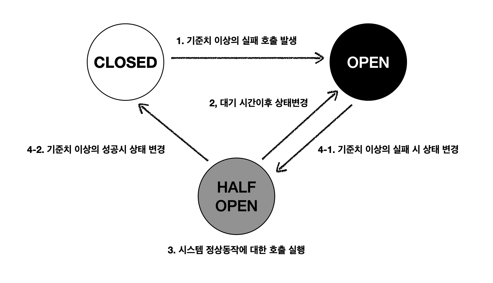

## 서킷 브레이커

서킷 브레이커는 장애가 발생한 서비스를 격리시켜 전체 서비스의 장애를 방지하는 패턴입니다.
해당 패턴을 사용하여 장애 발생율에 대한 기준치에 따라 타 서비스의 요청을 차단하여 장애 전파를 방지할 수 있습니다.
그 과정에서 실제 응답 및 동작을 대체한 결과를 반환하여 사용자에게 장애 노출을 최소화시키는 목적을 수행하기도 합니다.
서킷 브레이커가 어떻게 동작 하는지에 대한 흐름을 한번 살펴보겠습니다.

### 서킷 브레이커의 동작 흐름

1. 타서비스와의 통신 및 호출중 발생하는 지연 및 실패가 기준치에 도달했을시 open 상태로 변경한다.
- 서비스의 문제가 발생했다는 기준치를 일정 횟수 또는 일정 시간 간격을 기준으로 정할수 있다.
- closed -> open 상태로 변경시 타 서비스의 호출을 차단하고 대채할수 있는 응답인 fallback 메소드를 실행한다.    
2. open 상태에서 타서비스의 장애 복구가 될수 있는 시간까지를 기다린후 half_open 상태로 변경한다.
- 타서비스가 회복되기까지의 대기 시간을 설정하여 기다린후 정상적인 동작이 가능한지 점검을 위해 half_open 상태로 변경한다.   
3. half_open 상태에서 정상적인 서비스 회복이 가능한지 점검을 위해 차단한 호출을 열어두어 수행한다.   
4. 점검을 위한 호출을 수행 정상 동작에 대한 임계치를 기준으로 closed 또는 open 상태로 변경한다.
- closed 또는 open 으로의 상태 변경 임계치는 1. 에서의 closed -> open 으로의 상태 변경 임계치와 다르게 설정할수 있고 설정해야 한다.
    - closed -> open 으로의 상태 변경 임계치보다 더 낮은 값으로 설정하여 빠른 정상 회복을 할수 있다.
