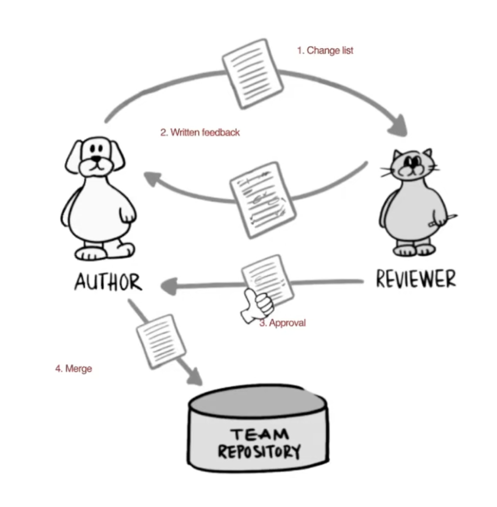
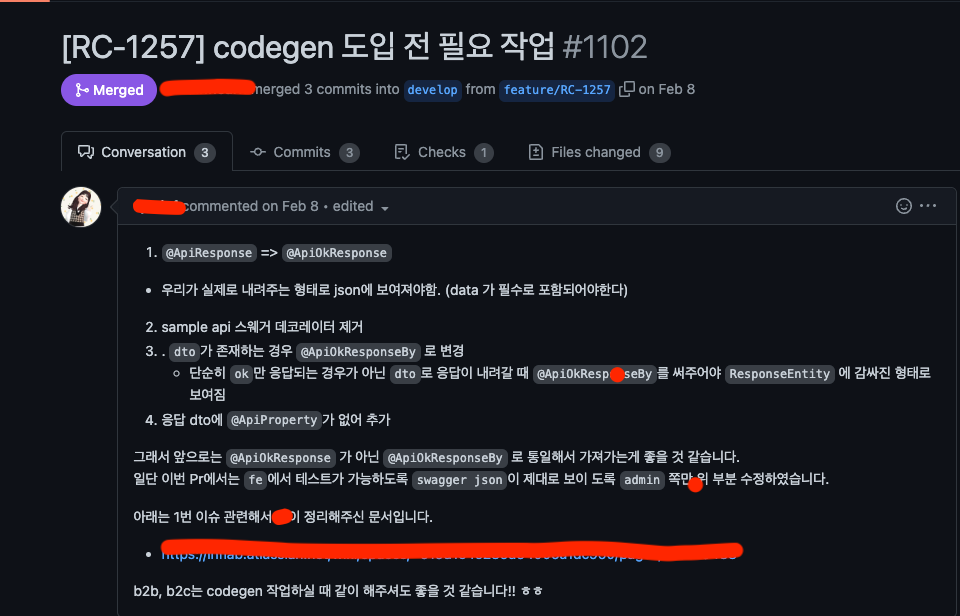
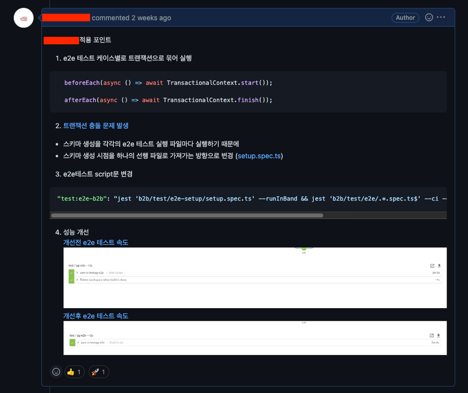
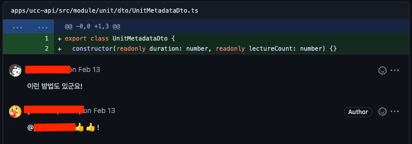
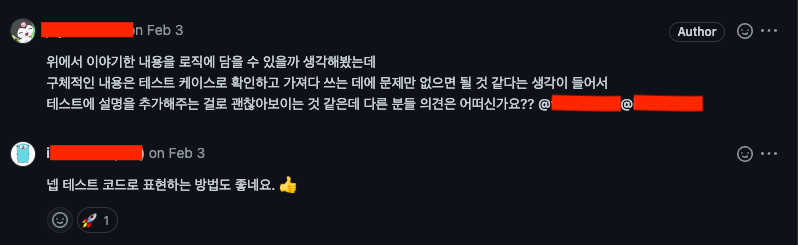
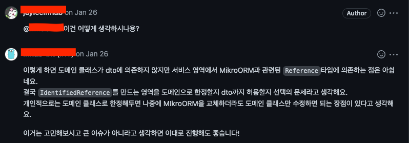

부제: "코드 리뷰 보다는 코드 토크"


## Table of Contents
1. [코드 리뷰는 아마 이런게 아닐까요?](#코드-리뷰는-아마-이런게-아닐까요)
2. [코드 리뷰가 어렵다고 생각하시는 분 🤚](#코드-리뷰가-어렵다고-생각하시는-분-)
3. [내가 리뷰이라면,](#내가-리뷰이라면)
4. [내가 리뷰어라면,](#내가-리뷰어라면)


## 코드 리뷰는 아마 이런게 아닐까요?
사실 이 글을 보시는 분들은 코드 리뷰가 무엇인지는 대부분 아실거라고 생각합니다.

아래의 그림처럼 코드 리뷰는 강아지(리뷰이)가 코드의 변경 내역을 알리고 고양이(리뷰어)가 코드를 검토하면서 리뷰를 주고 받은 후 결과물을 반영하는 과정을 거치는 방법을 뜻하는데요.



뭐 이게 별거나 싶겠지만 사실 우린 코드 리뷰를 하면서 얻게 되는 것들이 아래와 같이 많습니다.
```
- 버그나 장애 예방 
- 더 나은 코드 품질을 위한 개선 
- 학습 및 지식 공유 
  - 하드, 소프트 스킬 역량 증대 
  - 팀워크, 동기 부여 
- 개발 문화
```
위와 같은 점들을 얻음으로써 우리는 코드 리뷰를 아래와 같이 다시 정의해보며 좋을꺼 같네요.   
> 코드 리뷰란 지속 가능한 서비스를 만듬과 동시에 배움을 주고 받음으로서 지속 가능한 개발자가 될 수 있는 방법

하지만 코드 리뷰가 중요하다고 생각하는 우리는 다들 마음으로 받아들이지만 몸으로서의 실천이 어려운 경우들이 많습니다.

## 코드 리뷰가 어렵다고 생각하시는 분 🤚

코드 리뷰가 나를 불편하게 만드는 이유는 크게 아래의 관점이 있을 수 있습니다. 
- **자신의 코드를 리뷰 받는것에 대한 두려움** 
  - 내 코드에 대한 지적 및 비판을 곧 자신에 대한 비판으로 생각하게 한다.
- **다른 사람의 코드를 리뷰하는 것에 대한 불편함** 
  - 다른 사람의 코드가 마음에 들지 않을 경우 이를 리뷰하기 위해 어떻게 표현해야될지를 생각하게 한다.
- **생각을 글로 전달하는 과정의 어려움**
  - 표정과 어투가 나타나지 않은 텍스트는 오해를 일으키기 쉽다. 
- **코드 리뷰를 함으로써 소요되는 노력과 시간**

이런 불편함을 해소하기 위해선 리뷰어, 리뷰이가 서로가 가져야할 역할,책임이 있게됩니다.   
저희가 지켜 나가야할 코드 리뷰의 규칙들은 다음과 같은 노력이 필요합니다.


## 내가 리뷰이라면,

### 우리가 정한 스타일 가이드 규칙을 숙지하기
- 주관적인 견해보다는 현재 개발팀이 정한 스타일 규칙의 일관성을 더 우선시 해주세요.
  - eslint, prettier 등의 도구를 통해 스타일 규칙을 자동으로 적용
  - 작성되어진 코드 컨벤션 가이드 문서

### 작은 단위로 pr를 요청하기
- [Pull request의 이상적인 크기](https://docs.google.com/document/u/1/d/e/2PACX-1vSPQ3PbGeLHy2_Icj4qvvvUlYdo90tzXOovHphuvsbs481-Q7m9knz1I1ubd2DBA21uz4RVQwDSVh2m/pub?fbclid=IwAR24zgsPoiArxkSFEmcEl7uLHe7LHnXjeNK5Uo5Kuj5rFkK3QOsEoWFVoR8&mibextid=Zxz2cZ&pli=1)와 그 이유에 대한 연구 조사에서도 나와있듯이, 
  - 1시간 이내에 완료되는 Pull Request 리뷰는 결함 발견률이 높고 200~400행 정도의 Pull Request는 1시간 이내에 리뷰가 완료될 가능성이 높습니다. 
  - 즉 이상적인 Pull Request의 크기는 200-400행을 권장합니다.

### 내가 작업한 내역에 대한 명확한 description을 작성하기
- 리뷰어는 나를 위해 “리뷰”라는 행위를 통해 시간과 노력을 소비합니다. 
- 리뷰어의 시간을 최대한 아껴주도록 변경된 작업물에 대한 설명을 이해하기 쉽게 작성해주세요.
- 예시)



### 리뷰어의 이해를 돕기위해 또는 미리 궁금해할수 있는 부분을 고려해 코멘트를 남기기
- 서로간의 커뮤니케이션 비용을 줄이기 위해 리뷰어가 쉽게 볼수 있도록 코멘트를 먼저 작성해주세요.
- 예시)



### 효율적인 리뷰를 위해 더 많은 사람들에게 내 작업물을 알리기
- 더 많은 사람들이 리뷰해줄수록 더 좋은 결과물을 얻게 됩니다.

## 내가 리뷰어라면,

### 코드 리뷰를 작업에 높은 우선순위로 두기
- 리뷰를 최대한 바로 시작해서 작업물에 대한 선순환을 만들어내야되요. 
- 리뷰이의 블로킹 시간을 막기위해 최대 하루를 넘지 않게 리뷰를 해주세요.

### 리뷰는 고수준에서 저수준으로 피드백 주기
- 고수준: 버그, 장애, 성능, 보안 등
- 저수준: 설계 개선, 네이밍 변경 등
- 처음부터 많은 리뷰를 남겨 리뷰이에게 위압감을 주기보다는 고수준 피드백으로 제한하여 리뷰를 해주세요.

### 칭찬에 인색하지 말기
- 지적과 비판, 피드백에 집중하지 말고 PR에서 좋은 변경이 있을때 마다 칭찬을 아끼지 마세요.
  - “~ 정말 유용하네요.” 
  - “~ 생각도 못 했네요” 
  - “~ 정말 좋은 생각이에요”
- 칭찬은 리뷰이에게 “나는 당신의 검열관이자 감시자가 아닌 팀의 동료이다.”라는 인식을 줍니다.
- 예시)


<br><br>


### 의견이 아니라 원칙에 기반하여 피드백하기

- 최대한 객관적인 논리적인 설명을 기반으로 리뷰해야 합니다.

- 주관적인 견해를 가지고 개발자의 성향을 리뷰하는 것을 지양해주세요.
- 예시)


