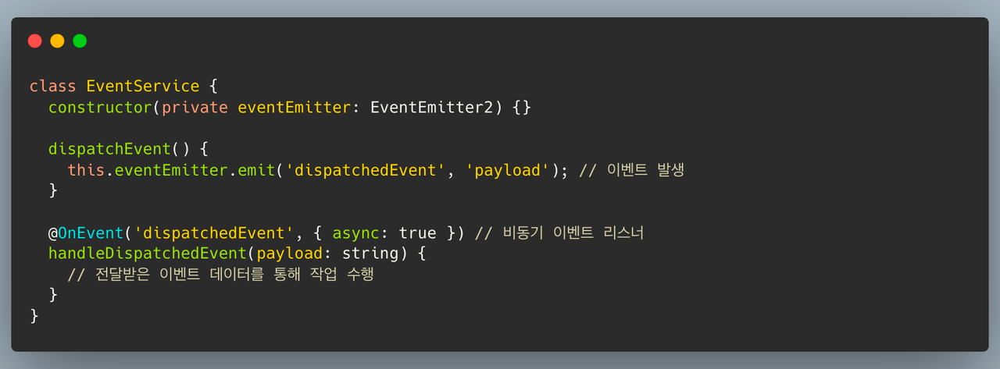
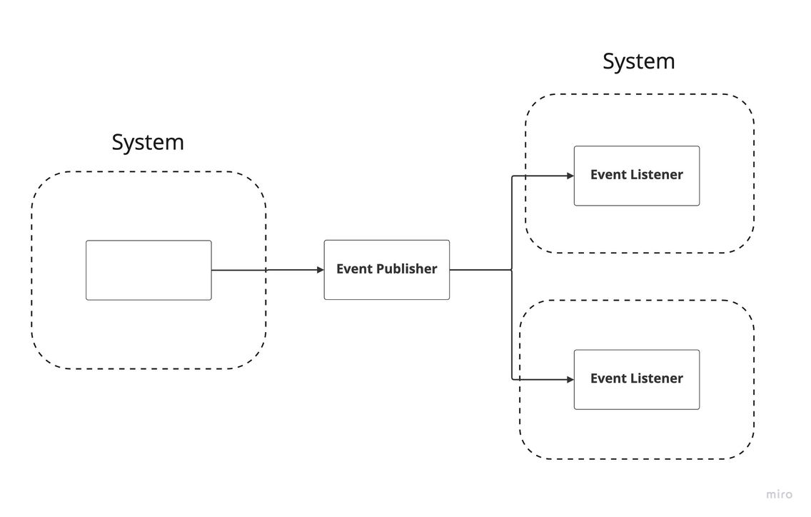
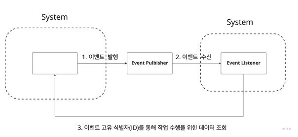

## 이벤트 종류

이번 장에서는 하나의 시스템 내부에서 일어나는 내부 이벤트와  타 시스템간에 사용되는 외부 이벤트에 대해서 알아보도록 하겠습니다.        
내부 이벤트와 외부 이벤트에 대한 용어는 익히 너무나 잘알려진 우아한 형제에 권용근님이 작성된 https://techblog.woowahan.com/7835/글에서 소개되어집니다.
(해당 글은 몇번을 읽어도 좋은 내용이니 꼭 참고해주시기 바랍니다.)

### 내부 이벤트

내부 이벤트는 (하나의 시스템) 내부에서 발생하는 이벤트들을 말합니다.     
내부 이벤트를 사용하는 목적은 도메인에 존재하는 비관심사를 분리하여 도메인의 응집도를 높이는것과 동시에 비관심사를 처리하기 위함입니다.     
메인 프로젝트 프레임워크인 NestJS에서는 @nestjs/event-emitter 모듈로 내부 이벤트를 구현할수 있습니다.

Node.js의 기본 내장 모듈로 제공해주는 EventEmitter 모듈의 확장 모듈이며 하나의 애플리케이션에서 발생하는 다양한 이벤트를 구독하고 수신할 수 있도록 하는 간단한 관찰자 구현을 제공합니다.       
아래의 코드와 같이 EventEmitter2 객체의 emit()라는 메소드를 통해 이벤트를 발생할 수 있으며 @OnEvent()데코레이터로 선언된 메소드가 이벤트 핸들러로 등록이 되어집니다.

여기서 중요한점은, 내부 이벤트를 발행할때 구독자에게 필요한 데이터인 payload를 함께 전달한다는 점입니다.

만약 payload의 데이터 변경이 발생하더라도 하나의 시스템 내에서 존재하기 때문에 이벤트의 발행이 구독자에게 미치는 영향을 파악하고 관리할수가 있습니다.
이렇게 외부에 알릴 필요없는 내부의 개념을 이벤트에 녹여 payload를 확장하는 것을 열린 내부 이벤트라고 합니다.
  

### 외부 이벤트

외부 이벤트는 (하나의 시스템) 외부에서 발생하는 이벤트로서 타 시스템간에 사용되어집니다.      
외부 이벤트를 사용하는 목적은 시스템과 시스템의 결합을 줄이는 것 즉, 느슨한 결합을 유지하기 위해서입니다.

여기서 중요한 점은 내부 이벤트와 달리 시스템 간의 결합을 느슨하게 만들기 위해 발행되는 외부 이벤트는 이벤트 발행처에서 이벤트 구독자가 어떤 행위를 하는지 몰라야된다는 점입니다.        
만약 이벤트 발행처가 이벤트 구독자의 행위에 관심을 갖게 된다면 이는 또 다시 논리적인 의존 관계가 형성됩니다.      
그러므로 느슨한 결합을 유지할수 있기때문에 이벤트안에 특정 구독자의 행위를 담은 payload를 전달할수 없습니다.
이처럼 타 시스템간의 변화에 영항을 받지 않기 위해 payload를 최소화하는 것을 닫힌 외부 이벤트라고 합니다.     

이 문제를 해결하기 위해 외부 이벤트에선 zero-payload 방식을 사용합니다.

