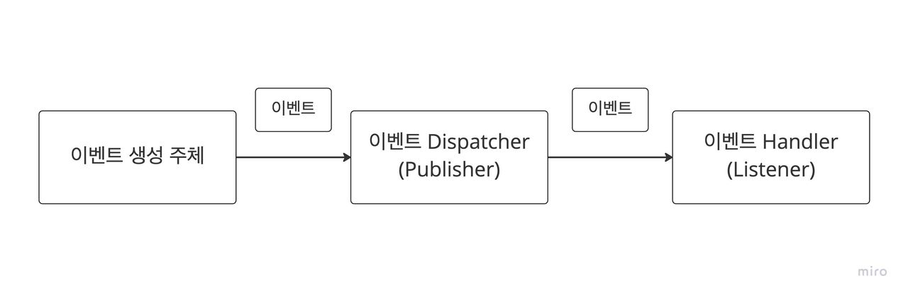
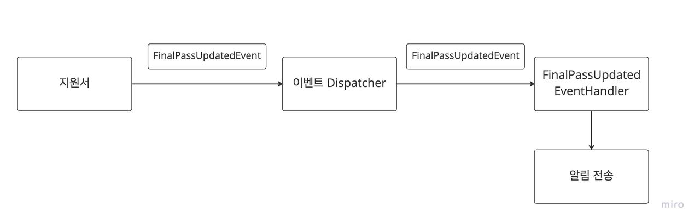
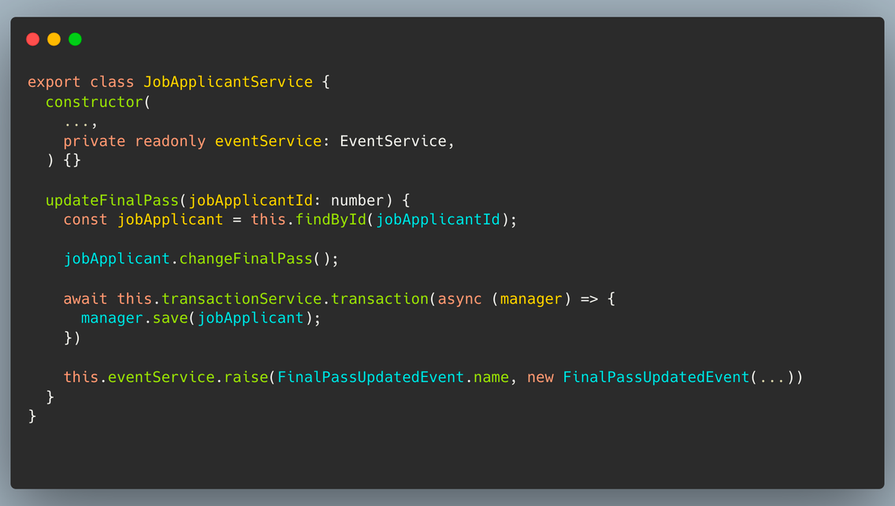
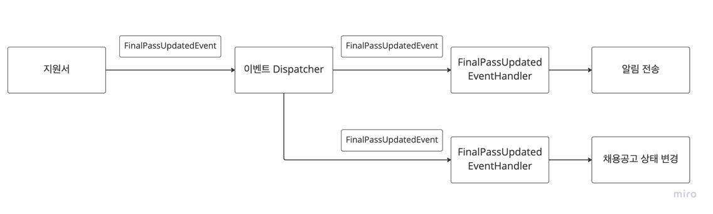

## 이벤트의 개요

### 이벤트 정의
이벤트라는 용어의 정의는 “**과거에 벌어진 어떤 것**”을 의미합니다.        
그래서 이벤트는 현재 기준으로 과거에 벌어진 것이기 때문에 이벤트 명은 과거 시제를 사용합니다.       
이벤트가 발생한다는 것은 상태가 변경됐다는 것을 의미하며 이벤트 발생에 반응하는 동작이 존재하게됩니다.       
여기서 알아야할 점은, **우리가 발행할 이벤트는 도메인 이벤트로 인해 반응하는 동작(목적)이 아닌 도메인 이벤트 그자체입니다.**

예를 들어 “지원자를 최종합격으로 변경시 해당 지원자에게 최종합격에 대한 알림” 이라는 요구사항에서는
- “지원자를 최종합격으로 변경”이 이벤트가 되고, 
- “해당 지원자에게 최종합격에 대한 알림”이 이벤트에 반응하여 동작하는 목적이 됩니다.

만약 이벤트에 담은 메세지가 대상 도메인에게 기대하는 동작(목적)을 담았다면, 물리적인 의존을 제거했더라도 개념적으로 결합도가 높은 상태입니다.        
결국 느슨한 결합을 보장해주지 않았고 우리는 이것을 이벤트라고 부르지 않습니다.
<br><br>

### 이벤트 구성요소
도메인 모델에 이벤트를 도입하려면 이벤트, 이벤트 생성 주체, 이벤트 디스패처, 이벤트 핸들러 이 4가지 구성요소에 대해 알고 있어야됩니다.



- 이벤트 
  - 이벤트 생성 주체 부터 시작해서 이벤트 핸들러까지 전달되는 객체 
  - 이벤트 이름은 과거 시제로 사용 
  - 이벤트 핸들러가 작업을 수행함에 있어서 필요한 데이터를 담고 있음.
- 이벤트 생성 주체 
  - 이름 그대로 이벤트를 발생하는 주체, 메인 대상 도메인 객체에 해당 
- 이벤트 디스패처 
  - 이벤트를 생성 주체에서 받아 핸들러까지 전파하는 기능을 제공 
  - 구현 방식에 따라 동기나 비동기로 실행
- 이벤트 핸들러 
  - 이벤트 디스패처로부터 이벤트를 전달받아 필요한 작업을 수행
    
이 4가지 구성요소로 지원자를 최종합격으로 변경시 해당 지원자에게 최종합격에 대한 알림을 전송에 대한 이벤트 처리 방식은 아래와 같이 이뤄지게 됩니다.


<br><br>

### 이벤트의 장점
이벤트를 사용하면 제일 먼저 **관심사로부터 비관심사를 분리할수 있습니다.**     
비관심사를 분리함으로써, 도메인 행위의 응집을 높이고, 비관심사에 대한 결합을 느슨하게 만들 수 있습니다.     
또한 코드상으로 주 도메인으로부터 다른 도메인 로직이 섞이는 것을 방지할수 있게 됩니다.       

아래와 같이 JobApplicantService에 주입받은 알림 도메인에 관련된 KakaoSenderService, MailerService 등과 객체간들의 의존성이 사라져 주요 관심사만의 높은 응집도와 비관심사의 낮은 결합도를 가져갈 수 있습니다.



두번째로 **기능의 확장성 용이입니다.**     
이것 또한 비관심사를 분리함으로써 얻게 되는 이점입니다.     
분리되는 관심사로 인해 각자의 강한 응집과 높은 재사용성을 확보할수 있음과 동시에 높은 확장성을 가집니다.     
예를 들어 지원서 최종합격 변경시 해당 채용공고의 상태 변경 로직이 추가된다면 지원서나 알림 도메인 로직에 영향없이 채용공고의 상태 변경을 처리하는 핸들러를 구현하면 됩니다.       
이벤트를 사용함으로써 기능 확장에 대해선 열려있고 기능 변경에 대해선 닫혀있는 OCP(개방-폐쇄의 원칙)을 지키게 됩니다.        




이렇게 이벤트의 장점에 대해서 알아봤는데요 아직 이전 장에서 제시한 문제점중 해소하지 못한 부분들이 있습니다.
- 외부시스템과의 트랜잭션 범위 문제 
- 외부시스템과의 연동을 통한 성능 문제

이 부분을 해결하기 위해선 비동기 이벤트 처리에 대해서 알아 볼 필요가 있습니다.
<br><br>

### 비동기 이벤트 처리
> 비동기라는 뜻은 이미 알고있다는 전제하에 설명을 이어가보겠습니다.

우리는 흔히 기능 개발을 할때 “A를 하면 이어서 B하라”라는 요구사항을 맞닿게 됩니다.       
근데 실제로 이 요구사항은 “A를 하면 최대 언제까지 B하라"라는 요구사항인 경우가 많습니다.        
즉 즉각적이면서 동기적으로 A 다음 B를 수행하는 기능이 아닌 일정 시간안에서만 A다음 B에 대한 후속 처리를 해야되는 경우들이 많습니다.

예를 들어 회원가입을 했을때 인증 메일을 전송이라는 요구사항이 있을때,     
회원가입 동작을 수행후 인증 메일은 몇 초가 지난후에 전송이 될수 있고, 또 재전송이라는 기능을 통해 재시도 처리가 가능합니다.     
외부 시스템에 연동되는 기능들이 대부분에 이에 해당되며 이 부분은 이벤트를 비동기로 처리하는 방식으로 구현할수 있습니다.     
이벤트를 비동기 처리로 처리하게 되면 외부시스템의 연동에 대한 성능 문제를 해결할 수 있습니다.       
이제 마지막 하나의 문제만을 남아두고 있습니다.
- 외부시스템과의 트랜잭션 범위 문제

사실 이벤트가 동기이든 비동기이든 DB 트랜잭션을 공유하게 되면 트랜잭션 실패에 대한 문제를 고려할수 밖에 없습니다.
<br><br>

### 트랜잭션 공유 여부에 따른 트레이드 오프

결론적으로 트랜잭션 공유 여부의 해결은 발행하려는 이벤트의 성격에 따라 달라질 수 있습니다.

발행 이벤트가 주요 행위와 강한 정합성을 보장
- 주요 행위와 트랜잭션, 성능을 공유
- 트랜잭션 완료후 이벤트 발행 

발행 이벤트가 주요 행위와 약한 정합성을 보장
- 주요 행위와 트랜잭션, 성능 분리
- 트랜잭션 완료후 이벤트 발행
- 이벤트 발행 실패가 트랜잭션 실패에 영향을 주지 않음.
- 이벤트 손실에 대한 이벤트 저장소를 구축해야 함.

```
개인적인 견해로는, 외부 시스템처럼 우리가 제어할수 없는 비관심사를 처리하는 경우에는 강한 정합성 보장이 아닌 약한 정합성을 보장해주는 방향으로 가져가야한다고 봅니다.
```
다시말해서, 사용자 또는 주요 비즈니스와 직결된 어플리케이션의 영향을 주는 방향보다는 분리하는 방향으로
가져가야합니다.

