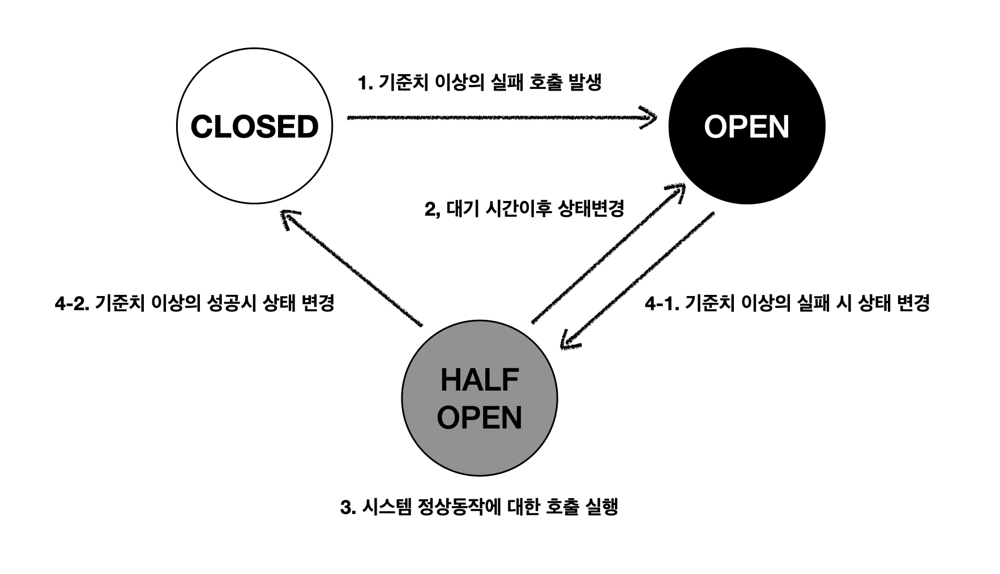

# 서킷 브레이커

서킷 브레이커는 장애가 발생한 서비스를 격리시켜 전체 서비스의 장애를 방지하는 패턴이다.
- 해당 패턴을 사용하여 장애 발생율에 대한 기준치에 따라 타 서비스의 요청을 차단하여 장애 전파를 방지
- 그 과정에서 실제 응답 및 동작을 대체한 결과를 반환하여 사용자에게 장애 노출을 최소화시키는 목적을 수행

## 서킷 브레이커가 필요한 상황

서킷 브레이커는 **외부 의존성이 있는 호출**에 적용한다. 내부 로직에는 필요하지 않다.

| 상황 | 예시 |
|------|------|
| 외부 API 호출 | 결제 PG사 API, 소셜 로그인 API, 지도/알림 서비스 |
| MSA 서비스 간 통신 | 주문 서비스 → 재고 서비스, 유저 서비스 → 인증 서비스 |
| DB 연결 | 외부 DB 또는 복제본 지연 시 |
| 메시지 큐 | Kafka, RabbitMQ 브로커 장애 시 |

서킷 브레이커 없이 장애가 발생한 서비스를 계속 호출하면 다음과 같은 문제가 발생한다.

```
[주문 서비스] --요청--> [재고 서비스 (장애)]
     ↓ 응답 대기 (타임아웃까지 스레드/커넥션 점유)
     ↓ 요청이 계속 쌓임
     ↓ 주문 서비스도 응답 불가 상태로 전이
     ↓ 연쇄 장애 (Cascading Failure)
```

## 서킷 브레이커의 3가지 상태

| 상태 | 의미 | 동작 |
|------|------|------|
| **Closed** | 정상 상태 | 모든 요청을 타 서비스로 그대로 전달한다. 실패를 카운팅하며 임계치를 초과하면 Open으로 전환한다. |
| **Open** | 차단 상태 | 타 서비스로의 요청을 차단하고 즉시 Fallback 응답을 반환한다. 설정된 대기 시간이 지나면 Half-Open으로 전환한다. |
| **Half-Open** | 점검 상태 | 제한된 수의 요청만 타 서비스로 전달하여 복구 여부를 확인한다. 성공하면 Closed, 실패하면 다시 Open으로 전환한다. |

## 서킷 브레이커의 동작 흐름



### 1. Closed → Open

타 서비스와의 통신 및 호출 중 발생하는 지연 및 실패가 기준치에 도달했을 시 Open 상태로 변경한다.
- 서비스의 문제가 발생했다는 기준치를 일정 횟수 또는 일정 시간 간격을 기준으로 정할 수 있다.
- Closed → Open 상태로 변경 시 타 서비스의 호출을 차단하고 대체할 수 있는 응답인 Fallback 메소드를 실행한다.

### 2. Open → Half-Open

Open 상태에서 타 서비스의 장애 복구가 될 수 있는 시간까지를 기다린 후 Half-Open 상태로 변경한다.
- 타 서비스가 회복되기까지의 대기 시간을 설정하여 기다린 후 정상적인 동작이 가능한지 점검을 위해 Half-Open 상태로 변경한다.

### 3. Half-Open → Closed 또는 Open

Half-Open 상태에서 정상적인 서비스 회복이 가능한지 점검을 위해 차단한 호출을 열어두어 수행한다.

점검을 위한 호출을 수행 후 정상 동작에 대한 임계치를 기준으로 Closed 또는 Open 상태로 변경한다.
- Half-Open → (Closed or Open)으로의 상태 변경 임계치는 1에서의 Closed → Open으로의 상태 변경 임계치와 다르게 설정할 수 있고 설정해야 한다.
- Closed → Open으로의 상태 변경 임계치보다 더 낮은 값으로 설정하여 빠른 정상 회복을 할 수 있다.

## 임계치(Threshold) 설정 기준

서킷 브레이커의 상태 전환은 임계치 설정에 따라 결정된다. 일반적으로 두 가지 방식을 사용한다.

### 실패 횟수(Count-based) 기반

최근 N개의 요청 중 실패 비율이 기준을 초과하면 Open으로 전환한다.

| 설정 항목 | 설명 | 예시 값 |
|----------|------|--------|
| slidingWindowSize | 판단에 사용할 최근 요청 수 | 10 |
| failureRateThreshold | Open 전환 실패율 (%) | 50% |
| minimumNumberOfCalls | 최소 호출 수 (이 수 이하이면 판단하지 않음) | 5 |

### 시간(Time-based) 기반

최근 N초 동안의 요청 중 실패 비율이 기준을 초과하면 Open으로 전환한다.

| 설정 항목 | 설명 | 예시 값 |
|----------|------|--------|
| slidingWindowSize | 판단에 사용할 시간 (초) | 10s |
| slowCallDurationThreshold | Slow Call로 판정하는 응답 시간 | 3000ms |
| slowCallRateThreshold | Slow Call 비율 기준 (%) | 80% |

### Half-Open 임계치

Half-Open 상태에서의 임계치는 Closed → Open 임계치보다 **낮게** 설정하여 빠른 복구를 유도한다.

```
Closed → Open:    실패율 50% 이상 (10건 중 5건)
Half-Open → Open: 실패율 30% 이상 (5건 중 2건)
```

## Fallback 전략

Open 상태에서 타 서비스 호출이 차단될 때, 사용자에게 반환할 대체 응답 전략을 선택해야 한다.

| 전략 | 설명 | 적합한 상황 |
|------|------|-----------|
| 캐시 반환 | 마지막 성공 응답을 캐시에 저장해두고 반환 | 상품 목록, 설정값 등 변경 빈도가 낮은 데이터 |
| 기본값 반환 | 미리 정의한 기본값을 반환 | 추천 상품 → 인기 상품 목록 반환 |
| 대체 서비스 호출 | 백업 서비스나 다른 경로로 호출 | 결제 PG사 A 장애 시 → PG사 B로 전환 |
| 빈 응답 / 에러 반환 | 기능 자체를 비활성화하고 사용자에게 안내 | 리뷰 서비스 장애 시 → "리뷰를 불러올 수 없습니다" |

```javascript
const fallback = (error) => {
  // 캐시에서 마지막 성공 응답 반환
  const cached = cache.get('inventory-data');
  if (cached) return cached;

  // 캐시도 없으면 기본값 반환
  return { available: true, message: '재고 확인 중입니다' };
};
```

## 코드 예시 (Node.js - opossum)

Node.js에서 가장 널리 사용되는 서킷 브레이커 라이브러리인 [opossum](https://github.com/nodeshift/opossum)을 사용한 예시이다.

```javascript
const CircuitBreaker = require('opossum');

// 타 서비스 호출 함수
async function fetchInventory(productId) {
  const response = await fetch(`https://inventory-service/api/products/${productId}`);
  if (!response.ok) throw new Error(`HTTP ${response.status}`);
  return response.json();
}

// 서킷 브레이커 생성
const breaker = new CircuitBreaker(fetchInventory, {
  timeout: 3000,              // 3초 이상 응답 없으면 실패 처리
  errorThresholdPercentage: 50, // 실패율 50% 이상이면 Open
  resetTimeout: 10000,         // Open 후 10초 뒤 Half-Open 전환
  volumeThreshold: 5,          // 최소 5건 이상 호출 후 판단
});

// Fallback 설정
breaker.fallback((productId) => {
  return { productId, available: true, message: '재고 확인 중입니다' };
});

// 상태 변화 모니터링
breaker.on('open', () => console.warn('[서킷 브레이커] OPEN - 재고 서비스 차단'));
breaker.on('halfOpen', () => console.info('[서킷 브레이커] HALF-OPEN - 재고 서비스 점검 중'));
breaker.on('close', () => console.info('[서킷 브레이커] CLOSED - 재고 서비스 정상'));

// 사용
app.get('/products/:id', async (req, res) => {
  const result = await breaker.fire(req.params.id);
  res.json(result);
});
```

### Java - Resilience4j 예시

Java/Spring 생태계에서는 [Resilience4j](https://github.com/resilience4j/resilience4j)가 가장 널리 사용된다.

```java
CircuitBreakerConfig config = CircuitBreakerConfig.custom()
    .failureRateThreshold(50)           // 실패율 50% 이상이면 Open
    .slowCallDurationThreshold(Duration.ofSeconds(3)) // 3초 이상이면 Slow Call
    .slowCallRateThreshold(80)          // Slow Call 비율 80% 이상이면 Open
    .waitDurationInOpenState(Duration.ofSeconds(10))  // Open 후 10초 대기
    .slidingWindowSize(10)              // 최근 10건 기준
    .permittedNumberOfCallsInHalfOpenState(3) // Half-Open에서 3건만 허용
    .build();

CircuitBreaker circuitBreaker = CircuitBreaker.of("inventoryService", config);

Supplier<String> decoratedSupplier = CircuitBreaker
    .decorateSupplier(circuitBreaker, () -> inventoryService.getStock(productId));
```

## 다른 장애 대응 패턴과의 관계

서킷 브레이커는 단독으로 사용하기보다 다른 패턴과 조합하여 사용한다.

| 패턴 | 역할 | 서킷 브레이커와의 관계 |
|------|------|---------------------|
| **Retry** | 일시적 실패 시 재시도 | 서킷 브레이커 **내부에서** 재시도 후에도 실패하면 실패로 카운팅한다. 단, Open 상태에서는 Retry하지 않는다. |
| **Timeout** | 응답 대기 시간 제한 | 서킷 브레이커의 Slow Call 판정 기준이 된다. Timeout 초과 = 실패로 카운팅한다. |
| **Bulkhead** | 동시 요청 수 제한 | 서킷 브레이커와 함께 사용하여 특정 서비스 호출이 전체 스레드 풀을 점유하는 것을 방지한다. |
| **Rate Limiter** | 단위 시간당 요청 수 제한 | 서킷 브레이커가 서비스 장애를 감지하는 반면, Rate Limiter는 과부하 자체를 방지한다. |

### 조합 예시: Retry + Timeout + 서킷 브레이커

```
요청 → [Timeout 3초] → [Retry 최대 2회] → [서킷 브레이커] → 타 서비스
                                              ↓ (Open 상태)
                                          Fallback 반환
```

```javascript
// opossum + 재시도 조합 예시
const breaker = new CircuitBreaker(fetchWithRetry, {
  timeout: 3000,
  errorThresholdPercentage: 50,
  resetTimeout: 10000,
});

async function fetchWithRetry(productId, maxRetries = 2) {
  for (let attempt = 0; attempt <= maxRetries; attempt++) {
    try {
      return await fetchInventory(productId);
    } catch (error) {
      if (attempt === maxRetries) throw error;
      await sleep(1000 * attempt); // 지수 백오프
    }
  }
}
```

## 모니터링 및 알림

서킷 브레이커의 상태 변화는 반드시 모니터링해야 한다. Open 전환은 서비스 장애를 의미하므로 즉시 인지할 수 있어야 한다.

### 모니터링해야 할 지표

| 지표 | 설명 |
|------|------|
| 서킷 상태 (Closed/Open/Half-Open) | 현재 서킷 상태를 실시간으로 확인 |
| 실패율 (Failure Rate) | 슬라이딩 윈도우 내 실패 비율 |
| Slow Call 비율 | 응답 시간 기준 초과 호출 비율 |
| Fallback 호출 횟수 | Fallback이 빈번하면 장애가 지속되고 있다는 신호 |
| 상태 전환 이력 | Open/Close 전환 시점과 빈도 |

### 알림 설정 기준

```
[Critical] 서킷 브레이커 Open 전환 → 즉시 알림 (Slack, PagerDuty 등)
[Warning]  Fallback 호출 비율 증가 → 주의 알림
[Info]     서킷 브레이커 Closed 복구 → 정상 복구 알림
```

```javascript
// Prometheus 메트릭 연동 예시
breaker.on('open', () => {
  circuitBreakerState.set({ service: 'inventory' }, 1); // 1 = Open
  alertManager.sendCritical('재고 서비스 서킷 브레이커 Open 전환');
});

breaker.on('close', () => {
  circuitBreakerState.set({ service: 'inventory' }, 0); // 0 = Closed
  alertManager.sendInfo('재고 서비스 서킷 브레이커 정상 복구');
});
```
