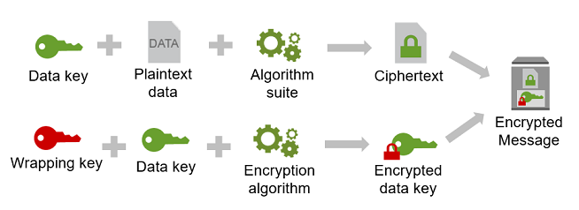

# Encryption SDK

## 개념 잡기

### Envelope Encryption - 봉투 암호화

암호화된 데이터의 보안은 데이터를 암호화시킨 데이터 키를 보호하는데 달려있다.
데이터 키를 보호하는 방법중 하나는 데이터 키를 암호화하는 것이다.
데이터 키를 암호화려면 암호화 키 또는 래핑 키라고 하는 또 다른 암호화 키가 필요하다.
래핑 키를 이용해 데이터 키를 암호화하는 방법을 봉투 암호화라고 한다.

데이터 키 보호
AWS Encryption SDK는 봉투 암호화를 사용하여 데이터 키를 보호한다.
먼저 메시지를 고유 데이터 키로 암호화한후 사용자가 설정한 (이때 설정은 keyring or master key provider를 통해 할수 있다.) 래핑 키로 데이터 키를 암호화 한다.
그리고 암호화된 데이터 키를 반환하는 암호화된 메세지에 암호화된 메시지를 함께 저장한다.

데이터를 암호화하기 위한 알고리즘과 데이터 키를 암호화하기 위한 알고리즘을 각각 지정할수 있다.
일반적으로 대칭 키 암호화 알고리즘은 비대칭 또는 공개 키 암호화보다 더 빠르고 더작은 암호 텍스트를 생성한다.
하지만 공개 키 알고리즘은 내재적으로 역할이 분리되어 있고 키 관리가 더 쉽다.
각각의 장점을 취하기 위해 대칭 키 암호화로 데이터를 암호화 한 다음 공개 키 암호화로 데이터 키를 암호화할수 있다.

