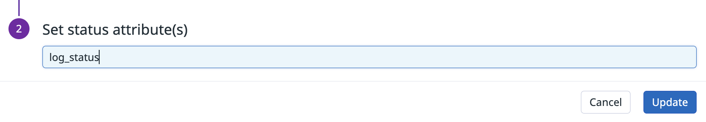

## datadog 

### logger level 을 datadog log status 와 매핑
- 카테고리 프로세서와 로그 상태 리매퍼를 사용하여 로그 레벨을 Datadog 로그 상태로 매핑
#### [카테고리 프로세서](https://docs.datadoghq.com/ko/logs/log_configuration/processors/?tab=ui#category-processor)
- 제공된 검색어와 일치하는 로그에 새 속성(새 속성 이름에 공백이나 특수 문자 없이)을 추가
#### [로그 상태 리매퍼](https://docs.datadoghq.com/ko/logs/log_configuration/processors/?tab=ui#log-status-remapper)
- 속성을 로그에 공식 상태로 할당
- 로그 상태를 사용하여 로그를 필터링하고 대시보드를 만들 수 있음
#### 파이프라인
1. 카테고리 프로세서로 생성
2. 신규 속성값(=ex) log_status)을 만듬
3. 기존에 사용되었던 로그 레벨 속성을 신규 속성값으로 매핑
예를 들어, http 상태 코드를 매핑시킨다면, 아래와 이미지로 확인할 수 있음

4. 로그 상태 리매퍼로 생성
5. 신규 속성값(=ex) log_status)을 사용하여 로그 상태를 매핑

