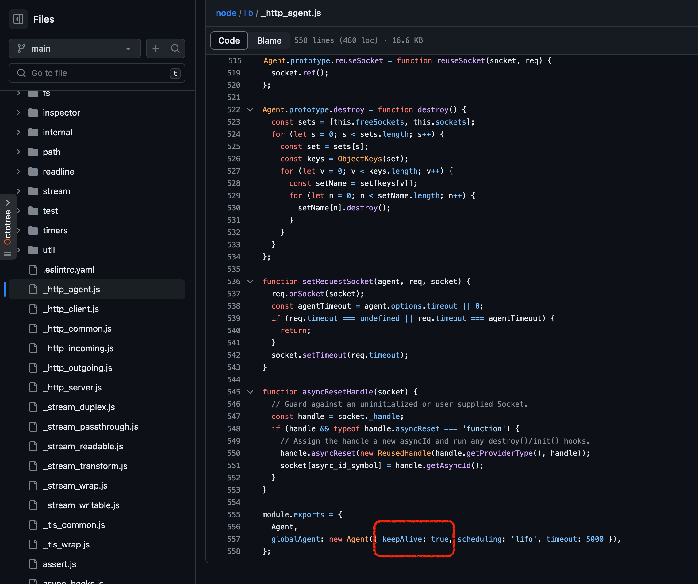

## HTTP keep-alive

웹 서버를 구축하면서 들어오게되는 HTTP 요청수를 처리하기 위해 많은 리소스를 소모하게된다.

HTTP 요청에 대한 오버헤드를 줄이고 리소스를 효율적으로 사용하기위한 가장 좋은 방법은 HTTP keep-alive를 사용하는 것이다.
- 일반적으로 많은 HTTP 클라이언트에서 기본적으로 활성화되어 있다. 
- 클라이언트는 연결 풀을 유지하여 각 연결이 한 번 초기화되고 연결이 종료될 때까지 여러 요청을 처리
- 연결을 재사용하면 DNS lookup, 연결 설정, SSL handshake 등의 오버헤드를 줄일 수 있다.
- 그러나 Node.js는 기본적으로 keep-alive 가 활성화되어 있지 않다.

### DNS Errors  
dns.lookup 에 대한 호출은 자바스크립트의 관점에서 보면 비동기 호출이지만, libuv의 스레드풀에서 실행되는 getaddrinfo(3)에 대한 동기 호출로 구현된다.        
이는 일부 애플리케이션에서 의외로 성능에 부정적인 영향을 미칠 수 있으며, `Error: getaddrinfo ENOTFOUND...` 오류를 만나게 된다.     
keep-alive를 활성화 하면 연결 재사용으로 서비스 내에서 산발적으로 발생하던 일련의 DNS 오류도 제거된다.        


### node-fetch 에 keep-alive 적용하기
```js
import http from 'node:http';
import https from 'node:https';
import fetch from 'node-fetch';

const httpAgent = new http.Agent({
	keepAlive: true
});
const httpsAgent = new https.Agent({
	keepAlive: true
});

fetch('https://www.google.com', {
    agent: (_parsedURL) => {
        if (_parsedURL.protocol === 'http:') {
            return httpAgent;
        } else {
            return httpsAgent;
        }
    }
});
```

### node 19 버전 부터는 keep-alive가 기본적으로 활성화 되어있다.




### 참고글
- [Stop Wasting Connections, Use HTTP Keep-Alive](https://www.lob.com/blog/use-http-keep-alive)
