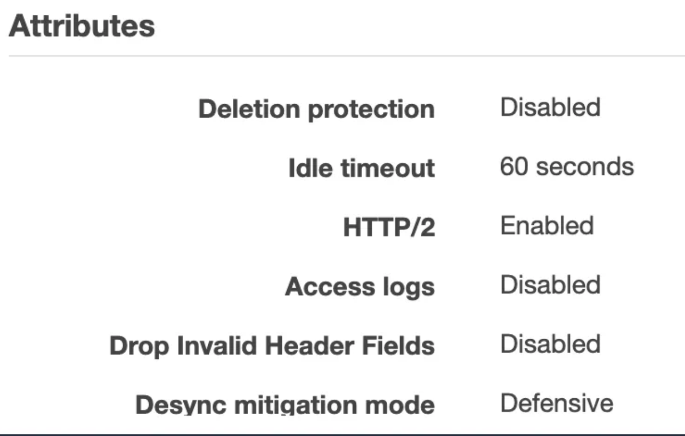

## HTTP Keep-Alive Timeout

만일 HTTP Keep-Alive를 활성화하고 있다면 발생할수 있는 오류들이다.

### Error: socket hang up or Error: read ECONNRESET
- 클라이언트가 연결이 정상적으로 유지되고 있다고 가정하고 있다가 요청을 보낼 때 서버가 연결을 끊어버리는 경우 발생한다.
- 보통 서버의 keepAliveTimeout이 클라이언트의 keepAliveTimeout보다 작은 경우 발생한다.
- node.js의 http.Agent의 keepAliveTimeout 기본값은 5s이다.
  - [문서](https://nodejs.org/api/http.html#serverkeepalivetimeout)

### AWS ELB 502 Bad Gateway with Node.js Server
- AWS ELB의 idle timeout의 기본값은 60s이다.

- node.js의 http.Agent의 keepAliveTimeout 기본값은 5s이다.
- 만약 기본값을 그대로 사용한다면, ELB가 연결을 끊어버리기 전에 node.js의 http.Agent가 연결을 끊어버리기 때문에 502 Bad Gateway가 발생한다.
  - [문서](https://docs.aws.amazon.com/ko_kr/elasticloadbalancing/latest/application/application-load-balancers.html#connection-idle-timeout)
- 따라서 ELB의 idle timeout을 60s로 설정하고 node.js의 http.Agent의 keepAliveTimeout을 61s로 설정하면 해결된다.

### Nestjs 에서 KeepAliveTimeOut 설정 방법

```ts

export class AppModule implements OnApplicationBootstrap {
  constructor(private readonly adapterHost: HttpAdapterHost) {}

  onApplicationBootstrap() {
    const server: Server = this.adapterHost.httpAdapter.getHttpServer();
    server.keepAliveTimeout = 61000;
  }
}
```
여기서 중요한건 httpAdapter의 getHttpServer() 메소드에서 nodejs http server 반환한다.    
getInstance() 메소드를 사용하면 nestjs를 래핑하고 있는 웹 프레임워크 express, fastify 를 반환합니다.


### 참고글
- [Tuning HTTP Keep-Alive in Node.js](https://connectreport.com/blog/tuning-http-keep-alive-in-node-js/)
