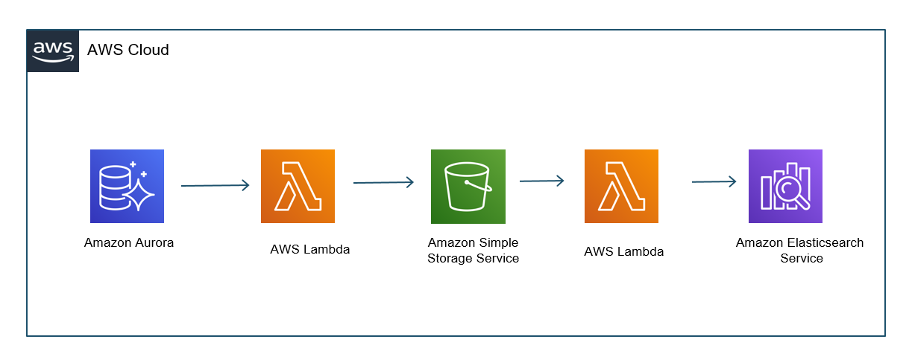

## Aws OpenSearch Service 문서 딥다이빙

### JVMMemoryPressure
- OpenSearch Service 클러스터에서 모든 데이터 노드에 사용되는 Java 힙의 백분율
- 높은 JVMMemoryPressure 원인
  - 리소스 양에 비례하여 클러스터에 있는 데이터 양
  - 클러스터 쿼리 로드

JVMMemoryPressure 비율에 따른 상황
- 75%: OpenSearch Service가 Concurrent Mark Sweep(CMS) 가비지 수집기를 시작합니다. CMS 수집기는 다른 프로세스와 함께 실행되면서 일시 정지 및 중단을 최소한으로 유지합니다. 
  - 참고: OpenSearch Service에서 여러 가비지 수집 지표를 Amazon CloudWatch에 게시합니다. 이 지표는 JVM 메모리 사용량을 모니터링하는 데 도움이 됩니다. 자세한 내용은 Amazon CloudWatch를 사용하여 OpenSearch 클러스터 지표 모니터링을 참조하세요. 
- 75% 초과: CMS 수집기가 메모리를 충분하게 회수하지 못해 사용량이 75%를 초과하면 OpenSearch Service JVM은 메모리 확보를 시도합니다. 또한 OpenSearch Service JVM은 프로세스 속도를 낮추거나 프로세스를 중지하여 JVM OutOfMemoryError(OOM) 예외를 방지합니다. 
- JVM이 계속 증가하고 공간이 회수되지 않으면 OpenSearch Service JVM은 메모리 할당을 시도하는 프로세스를 중지합니다. 중요한 프로세스가 중지된 경우, 하나 이상의 클러스터 노드가 실패할 수 있습니다. CPU 사용량을 80% 미만으로 유지하는 것이 좋습니다

JVMMemoryPressure 비율을 낮추기 위한 해결 방법
- 와일드카드 쿼리와 같은 범위가 넓은 쿼리를 실행하지 않습니다.
- 동시에 많은 수의 요청을 보내지 않습니다.
- 필요한 샤드 수를 확보했는지 확인합니다. 인덱싱 전략에 대한 자세한 내용은 [샤드 수 선택](https://docs.aws.amazon.com/ko_kr/opensearch-service/latest/developerguide/bp-sharding.html)을 참조하세요. 
- 샤드가 노드 간에 균등하게 분산되었는지 확인합니다. 
- 텍스트 필드에서 집계 작업을 수행하지 않습니다. 이를 통해 필드 데이터의 증가를 방지할 수 있습니다. 필드 데이터를 많을수록 힙 공간을 더 많이 차지하게 됩니다. GET _cluster/stats API 작업을 사용하여 필드 데이터를 확인합니다. 자세한 정보는 Elasticsearch 문서에서 fielddata를 참조하세요. 
- 텍스트 필드를 집계해야 하는 경우 매핑 유형을 keyword(키워드)로 변경합니다. JVM 메모리 압박이 너무 높은 경우 POST /index_name/_cache/clear(인덱스 수준 캐시) 및 POST /_cache/clear(클러스터 수준 캐시)와 같은 API 작업을 사용하여 필드 데이터 캐시를 지웁니다. 참고: 캐시를 지우면 진행 중인 쿼리가 중단될 수 있습니다.

레퍼런스
- [내 OpenSearch Service 노드가 충돌하는 이유는 무엇인가요?](https://repost.aws/ko/knowledge-center/opensearch-node-crash)

### 할당량
- https://docs.aws.amazon.com/ko_kr/opensearch-service/latest/developerguide/limits.html#ebsresource

### 샤드 전략

- https://esbook.kimjmin.net/03-cluster/3.2-index-and-shards
- https://docs.aws.amazon.com/ko_kr/opensearch-service/latest/developerguide/bp.html#bp-sharding-strategy
- https://docs.aws.amazon.com/ko_kr/opensearch-service/latest/developerguide/bp-sharding.html

### 동의어 사전 패키지 적용
OpenSearch Service 동의어 사전 처리 
1. s3에 파일 업로드
2. OpenSearch Service 패키지 등록
3. OpenSearch Service 도메인에 패키지 연결

- Amazon S3에 새 버전의 패키지를 업로드해도 OpenSearch Service 에 패키지가 자동으로 업데이트되지 않습니다. 
- OpenSearch Service는 파일의 자체 복사본을 저장하므로 새 버전을 S3에 업로드하는 경우 수동으로 업데이트해야 합니다.

OpenSearch Service 동의어 사전 처리
1. s3에 파일 업로드
2. OpenSearch Service 패키지 업데이트
3. OpenSearch Service 도메인에 패키지 업데이트 적용
4. 도메인에서 OpenSearch 또는 Elasticsearch 7.8 이상을 실행하고 updateable 필드가 true로 설정된 search analyzer 만을 사용하는 경우 추가 작업은 필요하지 않습니다. 
   OpenSearch Service는 [Refresh search analyzer](https://docs.opensearch.org/latest/im-plugin/refresh-analyzer/) API를 사용하여 인덱스를 자동으로 업데이트

레퍼런스
- https://docs.aws.amazon.com/ko_kr/opensearch-service/latest/developerguide/custom-packages.html
- https://aws.amazon.com/blogs/big-data/automate-amazon-es-synonym-file-updates/
