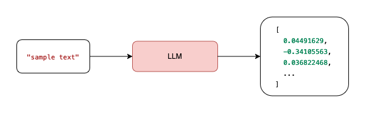

## Vector Search

### Basic
- 벡터 검색이란, 유사성 검색, nearest neighbor search 이라고 부르며, 주어진 입력과 가장 유사한 항목을 찾는 기술
- 사용 사례에는 사용자 의도를 이해하기 위한 semantic 검색, 이미지 인식 및 사기 탐지
- Vector Embedding
  - 벡터 검색은 데이터의 numerical representations(수치 표현)인 벡터 임베딩을 사용한다.
  - 임베딩은 다차원 벡터로 저장되어 의미, 맥락 또는 구조에서 더 깊은 패턴과 유사성을 포착한다.
  - 예를 들어, LLM (Lange Language Model)은 다음 이미지와 같이 입력 텍스트에서 벡터 임베딩을 만들 수 있습니다.


- 유사성 검색 (Similarity search)
  - OpenSearch는 [K-NN 알고리즘](https://en.wikipedia.org/wiki/K-nearest_neighbors_algorithm)을 사용하여 가장 유사한 벡터를 효율적으로 식별
  - 정확한 단어 일치에 의존하는 키워드 검색과 달리 벡터 검색은 고차원 공간의 거리를 기준으로 유사성을 측정한다.

- 유사성 계산 (Calculating similarity)
  - 벡터 유사성은 다차원 공간에 두 벡터가 얼마나 가까이 있는지 측정하여 가장 가까운 이웃 검색 및 관련성 순위와 같은 작업을 촉진한다.
  - OpenSearch는 벡터 유사성을 계산하기위한 여러 거리 메트릭 (공간)을 지원한다.
    - L1 (Manhattan distance): 벡터 구성 요소 간의 절대적인 차이를 요약합니다.
    - L2 (Euclidean distance): 제곱 차이의 합의 제곱근을 계산하여 크기에 민감합니다.
    - L∞ (Chebyshev distance): 해당 벡터 요소 간의 최대 절대 차이 만 고려합니다.
    - Cosine similarity: 크기보다는 방향에 초점을 맞추는 벡터 간의 각도를 측정합니다. 
    - Inner product: 순위에 유용 할 수있는 벡터 도트 제품을 기반으로 유사성을 결정합니다. 
    - Hamming distance: 이진 벡터에서 다른 요소를 계산합니다. 
    - Hamming bit: 해밍 거리와 동일한 원리를 적용하지만 이진에 인코딩 된 데이터에 최적화됩니다.
    
- [임베딩 벡터 생성 및 검색 방법에 대해](https://docs.opensearch.org/latest/vector-search/getting-started/auto-generated-embeddings/)


### Prerequisites

```
PUT _cluster/settings
{
  "persistent": {
    "plugins.ml_commons.only_run_on_ml_node": "false",
    "plugins.ml_commons.model_access_control_enabled": "true",
    "plugins.ml_commons.native_memory_threshold": "99"
  }
}
```

### Development
1. Choose an ML model
2. Register and deploy the model
3. Create an ingest pipeline
- [Text embedding processor](https://docs.opensearch.org/2.19/ingest-pipelines/processors/text-embedding/)
  - text field 로 부터 vector 임베딩을 생성해주는 역할
```
PUT /_ingest/pipeline/nlp-ingest-pipeline
{
  "description": "An NLP ingest pipeline",
  "processors": [
    {
      "text_embedding": {
        "model_id": "<<model_id>>",
        "field_map": {
          "<input_field>": "<vector_field>"
        }
      }
    }
  ]
}
```
4. Create a vector index
- [knn_vector](https://docs.opensearch.org/2.19/field-types/supported-field-types/knn-vector/) field
```
PUT /my-nlp-index
{
  "settings": {
    "index.knn": true,
    "default_pipeline": "nlp-ingest-pipeline"
  },
  "mappings": {
    "properties": {
      "passage_embedding": {
        "type": "knn_vector",
        "dimension": 768,
        "space_type": "l2"
      },
      "text": {
        "type": "text"
      }
    }
  }
}
Copy

```

5. Search the data
- [Neural query](https://docs.opensearch.org/2.19/query-dsl/specialized/neural/)
  - K 
    - k-NN(최근접 이웃, k-Nearest Neighbors) 검색에서 “k”는 사용자가 한 번의 검색 요청에 대해 몇 개의 결과를 받을지 결정하는 값입니다. 예를 들어, k=5로 설정하면, 쿼리와 가장 유사한 5개의 결과(문서, 이미지 등)를 반환
    - k 개수를 지정하더라도 top-level size 파라미터로 최종 결과 hit 수를 좌우한다.
      - 일반적으로 size ≤ k로 두는 게 안전하다. k는 후보군, size는 최종 반환이므로 size가 k보다 크면 원하는 개수를 못 채우거나 성능/품질에 영향이 있을 수 있음.
  
```
GET /my-nlp-index/_search
{
  "_source": {
    "excludes": [
      "passage_embedding"
    ]
  },
  "query": {
    "neural": {
       "<vector_field>": {
          "query_text": "<query_text>",
          "query_image": "<image_binary>",
          "model_id": "<model_id>",
          "k": 100
      }
    }
  }
}

```


### Reference
- [Generating embeddings automatically](https://docs.opensearch.org/2.19/vector-search/getting-started/auto-generated-embeddings/)
