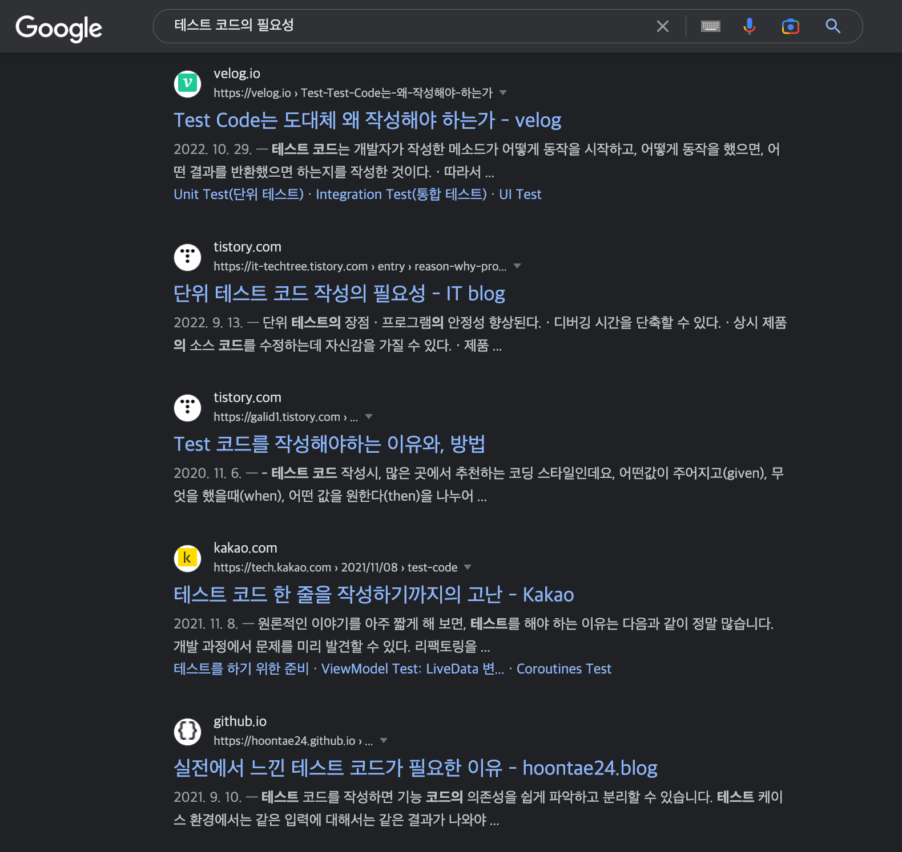
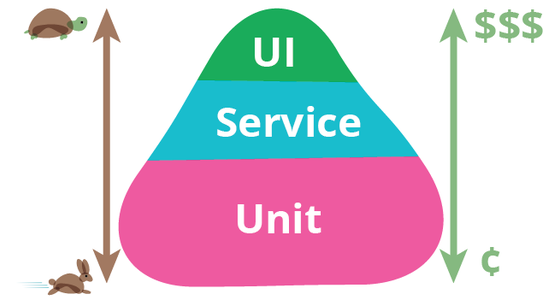

# 테스트 코드를 왜 작성하는 것인가?
> “테스트 코드를 작성하는 이유가 단지 지금 막 작성한 코드를 검증하기 위함이라면 그건 테스트 코드의 존재의 이유를 모르는 것이다.” - 필자

“테스트 코드가 왜 필요한것인가?”에 대해서 구글링을 하면 정말 수많은 레퍼런스들이 나온다.

구글에게 물어본 테스트 코드의 필요성

필자가 얘기할 내용들도 저 수많은 레퍼런스중 하나이겠지만 테스트 코드가 필요없다고 생각했던 시절부터 테스트 코드 없으면 안되는 현재까지의 경험을 가지고 있는 필자의 경험을 빗대어 이야기를 해보겠다.  
그렇다면 ㄲㄲ

## 첫번째 이유. 디버깅 비용 절감
> 개발자가 총 개발 소요 시간중 온전히 요구사항에 대한 기능 개발을 하는 시간이 전체의 비중을 어느정도를 차지할까?

위와 같은 물음에 자체 서비스 회사에서 서비스를 운영하고 유지보수를 해보았다면 생각보다 많은 비중을 차지 않는다는 것을 안다.

애플리케이션은 항상 내결함성을 가지고 있고 좋은 코드와 설계를 갖추더라도 결함의 존재 자체를 부정할 수 없다.     
그래서 기능에 대한 버그는 항시 발생하고 그것에 해결하기 위해 개발자는 디버깅의 행위를 꾸준히 할수 밖에 없다.

필자도 이전 회사에서 버그와 이슈들을 리포트 받고 디버깅하고 해결하는데 많은 시간을 소비했었다.
조금 더 그 시간을 쪼개보자면 **문제를 해결하는 시간보다 문제를 찾기 위한 시간이 더 많았었다.**
어느 코드 블록에서 문제가 발생했는지 어떤 케이스에서 문제가 발생했는지 알기 너무 힘들었기 때문이다.

기존 코드들을 보면서 디버깅하는 내 모습

*그렇다면 테스트 코드가 있는 지금의 프로젝트는 어떤가?* 

위에서도 언급했듯이 견고한 테스트를 작성하더라도 완벽하게 결함을 없앨 순 없다.  
하지만 테스트를 통해 오류를 줄일수 있었고 빠르게 대처할 수 있는 내성이 생긴다.  
테스트는 아래의 그림과 같이 범위와 비중에 따라 세 분류(e2e, integration, unit)로 나뉘어지고 각각의 역할을 가지고 있다.  

- unit 테스트: 도메인 모델과 비즈니스 로직을 테스트, 작은 단위의 코드 및 알고리즘 테스트
- integration 테스트: 코드의 주요 흐름들을 통합적으로 테스트하며 주요 외부 의존성(ex. 데이터베이스)에 대해서 테스트
- e2e 테스트: 최종 사용자의 흐름에 대한 테스트이며 외부로부터의 요청부터 응답까지 기능이 잘 동작하는지에 대한 테스트 

이렇게 구분지어진 테스트 구간의 경계로 인해 문제가 되는 코드의 범위와 케이스를 빠르게 파악하고 수정할수 있었다.
테스트로 인해 **결함을 최소화시켜 디버깅에 소모되는 시간을 줄어듬으로써, 서비스 개발자가 비즈니스 개발에 집중하면서 생산성 향상에 도움을 준 것이다.**

## 두번째 이유. 코드 변경에 대한 불안감 해소
> "버그를 고쳤는데 다른데서 또 터지네…" 

위와 같은 상황이라면 여러분은 회귀 버그를 겪고 있는 것이다.

> 회귀 버그
이전에 제대로 작동하던 소프트웨어 기능에 문제가 생기는 것을 가리킨다.
일반적으로 회귀 버그는 프로그램 변경 중 뜻하지 않게 발생한다.
> - 위키 백과

이러한 유형의 버그는 정말 비일비재하게 겪게 된다.

왜 그런 것일까?

사실 이유를 생각해보면 당연하다고 생각이 든다.

애플리케이션에서 기능은 단일 하나의 요소(함수, 객체, 도메인)로 이루어지지 않고 여러 요소들이 서로 상호작용하고 협력하기 때문이다.  
그렇기 때문에 하나의 기능을 수정할때 구성된 요소가 다른 기능과도 협력하고 있고 영향을 주기 때문에 회귀 버그를 겪게 되는 것이다.  

그렇다면 회귀 버그를 완전히 차단하고 예방할수 있을까?

필자는 위에서 말했듯이 애플리케이션의 기능은 요소들이 상호작용으로 만들어지기 때문에 사실상 그건 불가능하다고 본다.  
회귀 버그는 예방하는 것이 아니라 관리하고 대처해야 한다.  

다시 말해 우리는 회귀 테스트를 해야 한다.  

회귀 테스트는 기능 추가나 오류 수정으로 인해 새롭게 유입되는 오류가 없는지 검증해준다.   
개인적으로 필자가 테스트가 수백개 수천개 있는 프로젝트를 진행하면서 느낀점 중 가장 크게 와닫는 테스트의 이점이다.    

회귀 테스트를 통해 기능 QA를 진행하면서 QA를 도와준 PO분들이 기존 기능이 잘 동작하는지만 집중할수 있게 만들어 주었고 서비스의 안정성을 보장해주었다.    
(오해할수 있는 부분이라 부연설명으로 PO는 개발자의 기능이 잘 동작하게 확인하고 점검해주는 QA담당이 메인업무는 아니라고 생각한다.)

**테스트 코드는 그때 당시의 기능을 만들기 위해서만 필요한 코드가 아니다.**  
그 이후에  
- 요구사항이 변경되어 기존 코드를 수정하거나
- 더 나은 코드를 위해 리팩토링을 하거나
**서비스가 지속 가능하기 위해 발전하기 위해 필요한 코드이다.**
  
## 세번째 이유. 더 나은 문서 자료
> "아우.. 레거시 코드들 너무 읽기 힘들어.."

우리는 좋은 코드를 작성하기위해 잘 읽혀지는 코드, 가독성 좋은 코드를 작성하려고 노력한다.  
하지만 클린 코드를 만들기위해 아무리 예쁘게 작성하더라도 서비스 복잡도가 늘어남으로써 한계가 있다. 
그리고 복잡한 요구사항이 중첩되어있는 기능들은 신규 입사자들이 코드를 이해하는데 많은 불편함을 준다.

그래서 우리는 그들의 편의를 위해 따로 문서화를 해둔다. 그리고 난 뒤에 우리는 그 문서를 쉽게 방치한다.
이것이 문서화의 가장 고질적인 문제점이다.  

*이 문제점이 발생하는 이유가 무엇일까?*

필자의 생각은 개발자가 문서와 코드를 같은 유지보수 대상과 범주로 가져가는게 어렵기 때문이라고 생각한다.  
두 대상을 분리하고 물리적인 거리감이라는 이유로 코드의 수정에 맞춰 문서의 최신화가 잘 이루어지지 않는 경우들이 많다.  
그래서 소스 코드외의 별도의 문서자료들은 관리대상으로서 쉽게 제외되기 때문에 신뢰하기 어렵다.  

필자 또한 그래왔다.

테스트를 작성하기 전에는 문서화를 따로 했었고 나중에는 문서를 새로 만드는 것보다 기존 문서들을 유지보수하는 것이 더 귀찮은 일이라고 생각했다.  
하지만 테스트 코드를 작성하면 테스트를 귀찮은 일이라고 생각했던 문서의 역할을 해줄수 있다는 것을 알게 되었다.  

*문서화할 내용을 나와 가장 가까운 IDE, 코드에 배치하는건 어떨까?*

아래와 같이 테스트를 작성할때 가장 먼저 명세를 작성한다.  
`기존에 중복된 메일이 있는 경우 회원가입을 할 수 없습니다.`

이렇게 테스트를 작성할때 코드의 실제 동작을 기술함으로써 문서의 역할을 만들어 이 코드가 어떤 역할을 가졌는지를 누군가를 이해하는데 도와준다.

**문서화 테스트는 기능과 코드를 이해하는데 도움을 준다.**

## 네번째 이유. 좋은 코드는 테스트하기 쉽다.
좋은 코드는 "변경하기 쉬운"이라는 형용사를 가지고 있다.    
이 의미는 약한 결합도을 가지고 있는 코드를 뜻하며 반대로 강결합이 되어있는 코드는 유지비용이 증감되어 저품질코드로 분류되어진다.    

*그렇다면 이러한 강결합으로 이루어진 코드를 테스트하기 쉬울까?* 

당연히 매우 어렵다.

외부의 영향을 받거나 내부적으로 의존성을 가지고 있는 코드는 변경에 유연하게 대응하지 못하고 재사용하기 어려운 코드들이다.    
그렇기 때문에 테스트를 작성하기 어려운 코드가 만들어지는 것이다.   

반면 개선된 코드는 테스트 하기 쉬운 코드이다. 그렇다고 테스트하기 쉬운 코드가 모두 좋은 코드가 되는 것은 아니다.
그렇지만 우리는 테스트를 작성하면서 하나의 지표를 세울수 있게 됬다.

**"만약 내가 작성한 코드가 테스트하기 어려운 코드라면 냄새나는 코드일 가능성이 높아."**

## 다섯번째 이유. 테스트 자동화
> "신이시여, 이 프로젝트를 구원해주소서."

개발자의 기도메타는 코드를 개발하면서 생기지 않는다. 
본인이 작성한 코드가 실제 운영 환경에 배포됬을때 그 기도는 시작된다.

*"내가 작성한 코드가 정상적으로 동작할까?*
*"내가 작성한 코드로 인해 다른 부분에서 오류가 생기지 않을까?*

이런 오만가지 생각이 들며서 개발자의 불안감을 점점 커져간다.

하지만 자동화 테스트가 있는 순간부터 우리는 CI에서 우리가 작성한 테스트 코드로 버그가 배포되는것을 방지할 수 있게된다.  
앞서 이야기한 변경에 대한 내성과 회귀 버그에 대한 방지를 지속적으로 코드 병합이 일어날때마다 테스트 할수 있으므로 소프트웨어의 품질또한 높여준다.  
즉, 테스트 코드가 존재함으로써 안정감 있는 프로젝트 아니 안정감이 있는 우리의 모습을 볼수 있게 된다. 

## 테스트 코드의 목표
이전까지 "테스트 코드를 왜 작성하는 것인가?" 에 대해서 5가지 이유를 설몀을 해보았다.  
아직까지 테스트 코드의 작성 이유를 모르겠다면 사실 필자가 할수 있는 것은 없다.  
하지만 그래도 우리는 테스트 코드의 목표를 한번만 정리하고 다음 파트로 넘어갔으면 한다.

> 테스트 코드는 지속 가능한 서비스, 프로젝트가 되게 하는게 목표이다.
