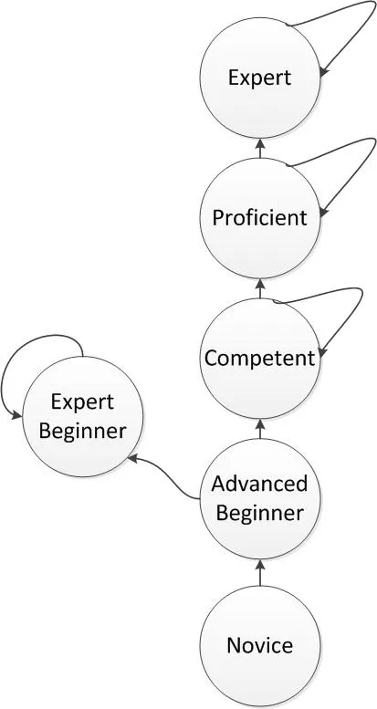

## 안주하는 개발자

### 1, 성장의 구속

초기 입문자는 새로운 기술에 대한 경험과 배움을 얻는다.

그것을 통해 자신만의 노하우와 스킬이 점점 생기고 그것을 통해 "낮은 곳에 달린 열매"들을 열심히 따며 빠르게 성장한다.     
하지만 그 위치에 열매들이 점점 바닥이 난 후에는 그전의 빠른 성장 곡선이 점점 느려지게 되고 그 기세가 껶여 완전히 멈춰버린다.    
이러한 현상을 통해 "성장의 구속"이 일어나며 이러한 정체 현상이 일어나는데 크게 두 가지 이유가 있다.

첫 번째는 자신의 능력에 대한 한계치가 도달한 것이며 두 번째는 자발적으로 의미있는 성장을 하려는 시도를 멈춘 마음가짐을 가진 것이다.     
첫 번째의 경우를 초기 입문자가 가지게 될 가능성이 적다.    
그렇지만 두 번째의 경우 Expert Beginner(전문적인 입문자)에게 흔히 발생하는 자신이 이미 전문가의 위치에 도달했으니, 더 이상의 성장은 불가능하다 라고 느끼는 이 감점에 대해서 알아보자.

### 2. Expert Beginner
:전문적인 입문자

그대로 해석하면 뭔가 이상하다. 전문적인 입문자라니.   
하지만 정확히 표현은 자신이 Expert(전문가)가 라고 착각하는 입문자를 뜻한다.



위의 그림은 드레이퍼스가 제시한 단계별 개발자의 다섯가지 모델이다.   
중점으로 봐야될 부분은 Advanced Beginner에서의 양갈래 길이다.     
하나의 길은 자신이 나아갈 큰 그림을 보고 자신의 위치를 자각하고 계속적으로 성장하는 Competent 단계이고 다른 하나의 길은 자신이 이미 전문가라고 생각하는 착각에 사로잡혀 올라가는 단계를 밟지 못하는 Expert Beginner 이다.

Expert Beginner는 이러한 논리적인 오류로 인해 자신의 더 나은 성장으로부터 멀어지게 된다.       
또한 자신이 해결할 수 없는 문제에 대해서는 자신의 역량 부족이 아닌 기술적인 한계 또는 다른 사람의 탓으로 돌리려는 성향을 가지게 된다.       
더 큰 성장을 할 수 있는 외부 커뮤니티와의 교휴에 관심이 없고, 자신은 이미 Expert 레벨에 올라갔다는 생각에 하나의 집단에서 오랫동안 안주하면서 스스로 높은 연봉을 받을 준비를 한다.

### 3. The Advanced Beginner Culture

Expert Beginner가 되지 않는 제일 중요한 것은 자기 자신의 들뜬 감정을 믿지 않는 것이다.   
자신이 한 것에 대해서 적절한 자신감을 가지되, 이성적인 주장 혹은 증거 없이 자신의 학습이 완성되었다는 생각을 지양해야 한다.     
건강한 겸손함과 지속적으로 성장하기 위한 노력을 겸비하고, 객관적 수치들을 주관적인 고려사항들보다 우선 순위를 둔다면 Expert Beginner의 길을 가지 않게 될 것이다.  
다 같이 성장할 수 있는 하나의 문화를 만들고자 한다면.

```
팀 멤버들에게 최대한 자유롭게 상상할 수 있는 기회를 주고, 그들이 발견한 방법을 직접 보여줄 수 있도록 해준다. (성공보다는 실패에서 배우는 것이 많다.)
새로운 언어, 접근법, 프레임워크, 패턴, 스타일 등을 학습하는 것에 대해 인센티브를 제공한다.
외부의 의견을 사내에 강제적으로 주입받을 수 있는 정책을 만들어라. (점심 시간을 이용한 네트워킹, 월간 트레이닝등)
가능하다면 논쟁이나 의견 충돌이 일어날 때 직급이나 투표 등의 주관적 기준이 아닌 좀더 객관적인 기준으로 해결한다.
증명하는 문화(Culture of proof)를 만들어라. 실제 레퍼런스, 통계, 사실 들이 확인되지 않으면 그 의견은 없는 것이나 다름 없다.
주기적으로 주니어와 시니어를 아우르는 설문을 진행해라. 그들의 강점과 강점의 개수만큼 자신이 모르는 것, 혹은 알고 싶은 것에 대한 것을 작성하도록 하라. 이것은 사전에 직원들이 (특히 오래된 직원들이)
자신이 "모든 것을 다 안다" 라고 생각하게 되는 분위기를 미연에 방지하기 위해서이다.
```
끝으로 팀원 누구든 "모르겠다" 라는 답변을 할 수 있는 문화를 만드는 것이 Expert Beginner들로 인한 집단의 부패를 방지하기 위한 중요한 방책이다.
Expert Beginner는 절대로 "모르겠다"라는 답을 하지 않는다.  
이는 곧 기숧을 배우고 있는 사람과 자신이 이미 알 건 다 안다고 생각하는 사람 사이의 중요한 차이다.


### Ref
- [[번역]더 이상 배우려 하지 않는 개발자 : Expert Beginner의 등장](https://medium.com/@jwyeom63/%EB%8D%94-%EC%9D%B4%EC%83%81-%EB%B0%B0%EC%9A%B0%EB%A0%A4-%ED%95%98%EC%A7%80-%EC%95%8A%EB%8A%94-%EA%B0%9C%EB%B0%9C%EC%9E%90-expert-beginner%EC%9D%98-%EB%93%B1%EC%9E%A5-dd40c40aeedf) 
