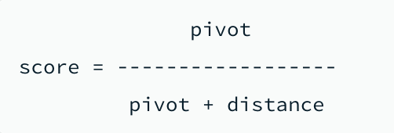

# MongoDB Atlas Search에서 $sort stage 사용 시 쿼리 지연 및 성능 이슈

## 개요

MongoDB Atlas Search를 사용하여 검색 엔진을 구축한 환경에서, 검색 결과를 좋아요순, 최신순, 인기순 등으로 정렬할 때 `$sort` stage를 사용하면 **쿼리 지연 및 성능 이슈**가 발생하는 문제를 경험했다.

원인은 `$search`와 `$sort`가 서로 다른 프로세스(mongot, mongod)에서 처리되면서, mongod가 대량의 데이터를 다시 조회하고 정렬해야 하는 구조적 문제였다. `near` operator와 `score function`을 활용하여 mongot 내부에서 score 기반 정렬을 수행하는 방식으로 해결했다.

## 환경

- **Database**: MongoDB Atlas
- **Search Engine**: Atlas Search (Apache Lucene 기반)
- **주요 프로세스**:
  - mongot: Apache Lucene 기반의 자바 웹 프로세스, `$search` stage 처리
  - mongod: MongoDB 시스템의 기본 데몬 프로세스, `$sort` stage 처리

## 증상

1. Atlas Search로 검색 후 `$sort` stage로 정렬 시 쿼리 응답 지연 발생
2. 정확도순 정렬(기본 score 정렬)에서는 문제가 없으나, 좋아요순/최신순/인기순 등 커스텀 필드 정렬 시 성능 저하
3. 데이터가 많을수록 지연이 심화

## 원인 분석

### 1. `$search` + `$sort` 간 프로세스 분리로 인한 병목


[공식문서](https://www.mongodb.com/docs/atlas/atlas-search/performance/query-performance/#-sort-aggregation-stage-usage)에 따르면, `$search` stage 다음 `$sort` stage를 사용하면 성능 이슈가 발생할 수 있다.

```javascript
// 문제가 되는 쿼리
db.aggregate([
  {
    $search: {
      text: {
        query: 'searchTerm',
        path: ['title', 'content']
      }
    }
  },
  {
    $sort: {
      'likeCount': -1 // 좋아요순 정렬
    }
  }
])
```

### 2. 지연 발생 메커니즘

`$search`와 `$sort`를 함께 사용하면 다음과 같은 흐름으로 처리된다:

```
[mongot 프로세스]
    │
    │  $search stage 실행
    │  → 검색어에 해당하는 항목의 id, 메타데이터를 반환
    │
    ▼
[mongod 프로세스]
    │
    │  1. 받은 id를 기반으로 DB 컬렉션에서 전체 문서 데이터 조회
    │  2. 조회된 데이터를 $sort stage를 통해 정렬
    │  → 대량의 데이터 조회 + 정렬 과정에서 지연 발생
    │
    ▼
[응답 반환]
```

mongot에서 반환된 id를 기반으로 mongod가 컬렉션에서 **전체 문서를 다시 조회**한 뒤 정렬을 수행하기 때문에, 데이터가 많을수록 병목이 심화된다.

## 해결 과정

### 시도 1: storedSource + returnStoredSource

mongot에 정렬에 필요한 필드를 미리 저장하여, mongod의 추가 조회를 제거하는 방식이다.

**storedSource**: 인덱스 정의에서 mongot에 저장할 필드를 지정
```json
{
  "storedSource": ["likeCount"]
}
```

**returnStoredSource**: `true`로 설정 시 DB 전체 문서 조회 없이 mongot에 저장된 필드만 반환

```javascript
db.aggregate([
  {
    $search: {
      text: {
        query: 'searchTerm',
        path: ['title', 'content']
      },
      returnStoredSource: true
    }
  },
  {
    $sort: {
      'likeCount': -1
    }
  }
])
```

정렬 필드 외 추가 필드가 필요한 경우 `$lookup`으로 보완 가능하다:

```javascript
db.aggregate([
  {
    $search: {
      text: {
        query: 'searchTerm',
        path: ['title', 'content']
      },
      returnStoredSource: true
    }
  },
  {
    $sort: {
      'likeCount': -1
    }
  },
  {
    $lookup: {
      from: "questions", localField: "_id", foreignField: "_id", as: "document"
    }
  }
])
```

커버링 인덱스와 유사하게 동작하여 성능이 개선되었으나, 다음과 같은 한계가 있었다:

- `$lookup` 등 추가 stage가 필요하여 쿼리 복잡도 증가
- 인덱스에 id + 정렬 필드까지 저장해야 하므로 인덱스 사이즈 증가
- 정렬 메모리 용량 한계를 초과하는 경우 발생
- 가중치 기반 복합 정렬에 대응하기 어려움
- `storedSource` 데이터와 실제 컬렉션 데이터 간 동기화 지연 가능 (인덱스 재구축 시점에 반영)

### 시도 2 (최종 해결): near operator + score function

별도의 `$sort` stage 없이, mongot 내부에서 **score 기반으로 정렬**을 수행하는 방식이다.

#### near operator

지정된 필드 값이 기준값(origin)에 가까울수록 score가 높아지는 operator이다. number, date, geometry 타입 필드에 사용 가능하다.

```javascript
{
   $search: {
      "near": {
         "path": "<field-to-search>",
         "origin": <date-or-number>,
         "pivot": <pivot-distance>,
      }
   }
}
```

| 파라미터 | 설명 |
|---------|------|
| `path` | 역인덱싱된 필드 (string 또는 string[] 타입) |
| `origin` | score 계산의 기준값. 필드 값이 이 값에 가까울수록 높은 score. 내림차순 정렬 시 필드 최대값보다 충분히 큰 값으로 설정 |
| `pivot` | score 감쇠 속도를 결정하는 값. 작을수록 값의 차이에 민감, 클수록 둔감하게 반응 |

**계산식**: `score = pivot / (pivot + |origin - path|)`



- distance가 0에 가까울수록 score가 1에 가까워짐
- distance가 커질수록 score가 0에 가까워짐

**pivot 값에 따른 score 변화 예시** (`origin: 100000` 기준):

| pivot | likeCount=99999 (거리=1) | likeCount=99990 (거리=10) |
|-------|--------------------------|---------------------------|
| 1 | score = 0.5 | score ≈ 0.09 |
| 100 | score ≈ 0.99 | score ≈ 0.91 |

#### 적용 예시: 좋아요순 정렬

```javascript
db.aggregate([
  {
    $search: {
      compound: {
        filter: [
          { text: {
              query: "searchTerm",
              path: ['title', 'content']
             }
           }
        ],
        should: [
          {
            near: {
              path: "likeCount",
              origin: 100000,
              pivot: 1
            } // 좋아요수 값이 100000에 가까울수록 score가 높아짐
          }
        ]
      }
    }
  }
])
```

`origin` 값은 필드 값보다 충분히 커야 값의 역전현상이 발생하지 않는다:
- 예: likeCount 최대값이 5000이라면, origin을 10000 이상으로 설정
- origin보다 큰 값이 존재하면, 더 큰 값을 가진 문서가 오히려 낮은 score를 받는 역전현상 발생

#### score function을 활용한 복합 정렬

`score function`을 사용하면 여러 점수를 조합하여 최종 score를 계산할 수 있다.

사용 가능한 표현식:
- Arithmetic expressions: 일련의 숫자를 더하거나 곱하는 표현식
- Constant expressions: 고정된 상수 값으로 점수를 설정하는 표현식
- Gaussian decay expressions: 지정된 비율로 점수를 감쇠시키는 표현식
- Path expressions: 인덱싱된 숫자 필드 값을 함수 점수에 통합하는 표현식
- Score expressions: Atlas Search에서 할당된 관련성 점수를 반환
- Unary expressions: log10(x) 또는 log10(x+1)을 계산하는 표현식
- [공식문서](https://www.mongodb.com/docs/atlas/atlas-search/score/modify-score/#function) 참고

```javascript
db.aggregate([
  {
    $search: {
      compound: {
        filter: [
          { text: {
              query: "searchTerm",
              path: ['title', 'content']
             }
           }
        ],
        should: [
          {
            near: {
              path: "_id",
              origin: 100000,
              pivot: 100000,
              score: {
                function: {
                  add: [ // 아래 두 점수를 더해 최종 점수로 계산
                    { path: "likeCount" },  // path 로 계산한 score
                    { score: "relevance" }  // $near 로 계산한 score
                  ]
                }
              }
            }
          }
        ]
      }
    }
  }
])
```

## 정리

| 구분 | 내용 |
|------|------|
| **문제** | `$search` 후 `$sort` 사용 시 mongod에서 전체 데이터 재조회 + 정렬로 인한 쿼리 지연 |
| **근본 원인** | `$search`(mongot)와 `$sort`(mongod) 간 프로세스 분리로 인한 구조적 병목 |
| **시도 1** | `storedSource` + `returnStoredSource`로 mongod 추가 조회 제거 → 인덱스 사이즈 증가, 쿼리 복잡도 증가 등 한계 |
| **최종 해결** | `near` operator + `score function`으로 mongot 내에서 score 기반 정렬 수행 |

### 방법별 비교

| 방법 | 장점 | 단점 | 적합한 상황 |
|------|------|------|------------|
| `$sort` stage | 구현이 단순함 | mongod에서 전체 데이터 조회 후 정렬하므로 성능 이슈 발생 | 데이터가 적은 경우 |
| `storedSource` + `returnStoredSource` | mongod의 추가 조회 없이 정렬 가능 | 인덱스 사이즈 증가, 데이터 동기화 지연, 쿼리 복잡도 증가 | 정렬 필드가 고정적이고 실시간 정합성이 덜 중요한 경우 |
| `near` + `score function` | 별도 정렬 stage 없이 mongot 내에서 처리, 가중치 기반 복합 정렬 가능 | origin/pivot 값 설정 필요, 부동소수점 정밀도 한계 | 가중치 기반 정렬이 필요하거나 대규모 데이터 환경 |

### 교훈

- Atlas Search의 `$search`(mongot)와 `$sort`(mongod)는 서로 다른 프로세스에서 처리되므로, 두 stage를 함께 사용하면 프로세스 간 데이터 전달 비용이 발생한다.
- 정렬 요구사항이 있을 때는 가능한 한 mongot 내부에서 score 기반으로 처리하는 것이 성능상 유리하다.
- `near` operator의 `origin`, `pivot` 값은 데이터 분포를 고려하여 설정해야 하며, 데이터 특성이 변하면 재조정이 필요할 수 있다.

## 참고

- [MongoDB Atlas Search - Query Performance ($sort stage usage)](https://www.mongodb.com/docs/atlas/atlas-search/performance/query-performance/#-sort-aggregation-stage-usage)
- [MongoDB Atlas Search - near operator](https://www.mongodb.com/docs/atlas/atlas-search/near/)
- [MongoDB Atlas Search - Score Function](https://www.mongodb.com/docs/atlas/atlas-search/score/modify-score/#function)
- [MongoDB Atlas Search - Stored Source](https://www.mongodb.com/docs/atlas/atlas-search/stored-source-definition/)
